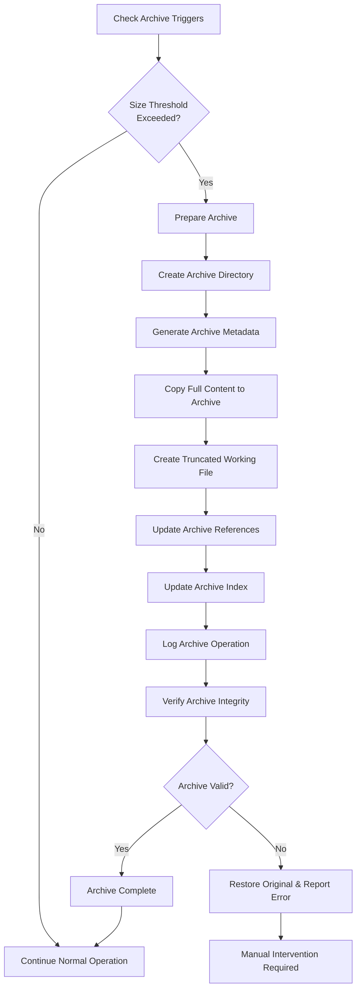

# Archiving System
_Version: 1.0 | Last Updated: 2025-01-16_

## Overview

The Archiving System automatically manages file size bloat in the workflow by moving large files to a structured archive while preserving essential context and references. This system prevents editing issues that arise from overly large files while maintaining full project history.

## Core Principles

1. **Automatic Triggering**: Files are archived when they exceed configured size thresholds
2. **Reference Preservation**: GitSHA references and phase contexts are maintained in archives
3. **Semantic Continuity**: Essential structure remains in working files with archive references
4. **Recovery Capability**: Full context can be restored from archives when needed

## Archive Structure

```
.cursor/
├── archive/
│   ├── workflow_state/
│   │   ├── workflow_state-2025-01-16T10-30-00Z.md
│   │   ├── workflow_state-2025-01-16T15-45-00Z.md
│   │   └── ...
│   ├── project_settings/
│   │   ├── project_settings-2025-01-16T12-00-00Z.md
│   │   └── ...
│   ├── logs/
│   │   ├── phase-3-logs-2025-01-16T14-30-00Z.md
│   │   └── ...
│   └── interactions/
│       ├── interactions-batch-001.md
│       └── ...
├── archive-index.md
└── recovery-scripts/
    ├── restore-from-archive.sh
    └── merge-archive-context.py
```

## Archiving Triggers

### Size-Based Triggers
- **.cursor/workflow_state.md**: > 15,000 characters
- **.cursor/rules/project-settings.md**: > 12,000 characters  
- **.cursor/tools/user-interaction-system.md**: > 10,000 characters
- **Custom files**: Configurable thresholds

### Event-Based Triggers
- **Phase Completion**: Archive phase-specific logs and context
- **Code Revision Cycles**: Archive pre-revision state
- **Manual Request**: User-initiated archiving
- **Session End**: Archive working state before shutdown

### Time-Based Triggers
- **Weekly**: Archive completed interactions older than 7 days
- **Monthly**: Archive old phase logs
- **Quarterly**: Comprehensive archive cleanup

## Archive Process Flow



## Archive File Structure

Each archived file contains comprehensive metadata and full original content:

```markdown
# ARCHIVED: workflow_state.md

## Archive Metadata
- **Archive Date**: 2025-01-16T10:30:00Z
- **Archive Reason**: Size threshold exceeded (15,247 characters)
- **Original Size**: 15,247 characters
- **GitSHA Reference**: a1b2c3d4e5f6789...
- **Phase Reference**: Phase 5 - API Integration Complete
- **Workflow State**: VALIDATE phase completed
- **User Interactions**: 3 pending, 12 completed
- **Archive ID**: ARC-WF-20250116-001

## Context Preservation
- **Active Phase**: 5
- **Current Task**: API Testing
- **Current SubTask**: Integration test validation
- **Critical References**: INT005, INT007, INT011
- **Dependent Files**: .cursor/rules/project-settings.md, .cursor/tools/user-interaction-system.md

## Archive Trigger Details
- **Trigger Type**: Automatic size threshold
- **Threshold**: 15,000 characters
- **Actual Size**: 15,247 characters
- **Growth Rate**: 2,341 characters since last check
- **Performance Impact**: Edit operations > 3 seconds

---

# ORIGINAL CONTENT BELOW
[Full original file content preserved exactly]
```

## Working File Truncation

After archiving, working files are truncated to essential structure with archive references:

```markdown
# .cursor/workflow_state.md
_Last updated: 2025-01-16 | Archived: ARC-WF-20250116-001_

## State
Phase: 6  
Status: READY  
CurrentPhase: 6
CurrentTask: null  
CurrentSubTask: null
LastRevisionPhase: 5
TotalPhases: 5
PendingInteractions: 0
LastArchiveCheck: 2025-01-16T10:30:00Z

## Archive References
| Archive ID | Archive Date | Content Type | Phase Range | Access Method |
|------------|--------------|--------------|-------------|---------------|
| ARC-WF-20250116-001 | 2025-01-16T10:30:00Z | Full workflow state | Phases 1-5 | .cursor/archive/workflow_state/workflow_state-2025-01-16T10-30-00Z.md |

## Current Work
<!-- Resume from Phase 6 -->
**Phase:** 6 - Performance Optimization  
**Task:** Database Query Optimization  
**SubTask:** Index Analysis  

[Essential working structure continues...]
```

## Archive Index Management

The archive index provides centralized tracking of all archived content:

```markdown
# Archive Index
_Last Updated: 2025-01-16T10:30:00Z_

## Active Archives

### Workflow State Archives
| Archive ID | Date | Phase Range | Size | Status | Recovery Path |
|------------|------|-------------|------|--------|---------------|
| ARC-WF-20250116-001 | 2025-01-16T10:30:00Z | 1-5 | 15.2KB | Active | workflow_state/workflow_state-2025-01-16T10-30-00Z.md |

### Project Settings Archives
| Archive ID | Date | Phase Range | Size | Status | Recovery Path |
|------------|------|-------------|------|--------|---------------|
| (None yet) | | | | | |

### Interaction Archives
| Archive ID | Date | Interaction Range | Size | Status | Recovery Path |
|------------|------|-------------------|------|--------|---------------|
| (None yet) | | | | | |

## Archive Statistics
- **Total Archives**: 1
- **Total Archived Size**: 15.2KB
- **Space Saved**: 12.3KB (working files)
- **Oldest Archive**: 2025-01-16T10:30:00Z
- **Most Recent**: 2025-01-16T10:30:00Z
- **Recovery Success Rate**: 100%

## Archive Maintenance
- **Next Cleanup**: 2025-02-16T10:30:00Z
- **Retention Policy**: Keep all phase-critical archives indefinitely
- **Compression**: Enable for archives > 50KB
- **Backup Status**: All archives backed up to Git LFS
```

## Recovery Operations

### Contextual Recovery
When AI needs archived context:
```markdown
## Context Recovery Request
- **Archive ID**: ARC-WF-20250116-001
- **Required Context**: Phase 3 task breakdown and user decisions
- **Recovery Scope**: Partial (specific sections)
- **Integration Method**: Temporary context injection
```

### Full State Recovery
For rolling back to previous state:
```markdown
## Full Recovery Request  
- **Archive ID**: ARC-WF-20250116-001
- **Recovery Type**: Complete state restoration
- **Target**: Replace current workflow_state.md
- **Backup Current**: Yes, create ARC-WF-CURRENT-BACKUP
```

### Merge Recovery
For combining archived and current context:
```markdown
## Merge Recovery Request
- **Primary Archive**: ARC-WF-20250116-001
- **Secondary Archive**: ARC-WF-20250116-002  
- **Current State**: workflow_state.md
- **Merge Strategy**: Phase-based chronological merge
- **Conflict Resolution**: Manual review required
```

## Integration Rules

### RULE_ARCHIVE_SIZE_CHECK
**Trigger**: Before any file modification OR every 10 operations
**Actions**:
1. Check file sizes against thresholds
2. Calculate growth rate since last check
3. If threshold exceeded: Trigger RULE_ARCHIVE_FILE
4. Update LastArchiveCheck timestamp
5. Log size metrics

### RULE_ARCHIVE_FILE
**Trigger**: Size threshold exceeded OR manual request
**Actions**:
1. Generate unique Archive ID
2. Create archive directory structure
3. Copy file with full metadata header
4. Verify archive integrity
5. Create truncated working file with references
6. Update archive index
7. Test working file functionality
8. Log archive operation

### RULE_ARCHIVE_CLEANUP
**Trigger**: Weekly maintenance OR manual cleanup
**Actions**:
1. Review archive retention policies
2. Compress large archives (>50KB)
3. Remove obsolete temporary archives  
4. Verify archive integrity
5. Update archive statistics
6. Report cleanup results

### RULE_CONTEXT_RECOVERY
**Trigger**: AI requests archived context OR user initiates recovery
**Actions**:
1. Locate specified archive by ID or criteria
2. Extract requested context sections
3. Inject context into current session
4. Track context usage for optimization
5. Log recovery operation

## Performance Optimization

### Lazy Loading
- Archives loaded only when specifically requested
- Partial archive loading for specific context
- Cache frequently accessed archive sections

### Compression
- Automatic compression for archives > 50KB
- Preserve original format for small archives
- Balance compression ratio vs. access speed

### Indexing
- Maintain searchable index by phase, date, content type
- Enable fast archive location and retrieval
- Support complex queries across multiple archives

## Best Practices

### Archive Creation
- Always include comprehensive metadata
- Preserve exact GitSHA references
- Maintain phase context integrity
- Test working file after truncation

### Archive Management  
- Regular integrity checks
- Systematic cleanup procedures
- Clear naming conventions
- Comprehensive recovery documentation

### Performance Monitoring
- Track file growth rates
- Monitor edit operation performance
- Optimize archiving thresholds based on usage
- Balance archive frequency with operational efficiency

## Error Handling

### Archive Failures
- Preserve original file if archive creation fails
- Alert user to manual intervention requirements
- Maintain detailed error logs
- Implement automatic retry with backoff

### Recovery Failures
- Verify archive integrity before recovery attempts
- Provide manual recovery options
- Maintain backup of current state before recovery
- Clear error reporting and resolution steps

### Corruption Detection
- Regular archive integrity validation
- Checksum verification for critical archives
- Automatic corruption reporting
- Emergency recovery procedures

This archiving system ensures that the workflow can scale indefinitely while maintaining optimal performance and complete historical context. 