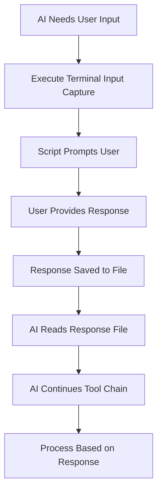
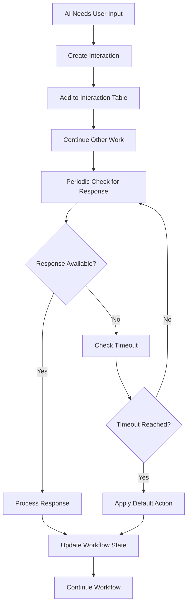

# User Interaction System
_Version: 2.0 | Last Updated: 2025-01-16_

## Overview

The User Interaction System provides two complementary approaches for handling user input:

1. **Non-Breaking Tool Chain Input** *(New)*: Captures user input during tool execution without breaking the chain
2. **Deferred Interaction Management**: Manages user interactions that can wait for later processing

## Method 1: Non-Breaking Tool Chain Input

### Purpose
Maximize use of all 25 tool calls by capturing user input during execution without stopping the tool chain.

### How It Works


### Implementation
```bash
# Tool N: Check interaction configuration
read_file: .cursorrules

# Tool N+1: Apply default action based on configuration
# Response handling integrated into workflow
```

### Usage Examples

#### Commit Approval
```bash
# AI checks configuration and applies default behavior
read_file: .cursorrules
# Based on mode setting, either auto-commit or defer
```

#### Choice Selection
```bash
# AI applies configured defaults for workflow direction
read_file: .cursor/workflow_state.md
# Continues with configured default path
```

#### Modification Requests
```bash
# AI applies default improvement priorities
# Based on predefined patterns in project settings
```

### Configuration

#### Script Parameters
- **Prompt Message**: Clear, specific question for user
- **Timeout**: Seconds to wait (default: 300)
- **Default Response**: What to use if timeout (optional)
- **Response File**: Where to save response (default: .cursor/user_response.txt)

#### Response Processing
```bash
# AI reads response and acts accordingly:
case "$response" in
    "approve"|"yes"|"y") 
        # Continue with planned action
        ;;
    "reject"|"no"|"n")
        # Skip or modify planned action
        ;;
    "modify"|"change")
        # Request specific modifications
        ;;
    "timeout")
        # Apply default action or skip
        ;;
esac
```

## Method 2: Deferred Interaction Management

### Purpose
Handle interactions that don't need immediate response and can be processed asynchronously.

### Core Components

#### 1. Interaction Manager
Handles creation, tracking, and resolution of user interactions.

#### 2. Interaction Types
- **COMMIT_APPROVAL**: Phase commit confirmation
- **PLAN_APPROVAL**: Blueprint plan approval  
- **MANUAL_INPUT**: Custom user input requests
- **CONFIRMATION**: Yes/No confirmations
- **CHOICE_SELECTION**: Multiple choice options
- **TEXT_INPUT**: Free-form text responses

#### 3. Response Processing
Automatic processing of user responses and workflow continuation.

### Interaction Flow



## Choosing the Right Method

### Use Non-Breaking Tool Chain Input When:
- ✅ Need immediate response to continue tool chain
- ✅ Response affects subsequent tools in current execution
- ✅ Want to maximize tool call efficiency
- ✅ Decision is critical for workflow continuation

### Use Deferred Interaction Management When:
- ✅ Response can wait for later processing
- ✅ Multiple interactions can be batched
- ✅ User might need time to consider response
- ✅ Interaction is informational rather than blocking

## Practical Examples

### Example 1: Phase Completion (Non-Breaking)
```bash
# Tool 18: Complete phase work
edit_file: update final component

# Tool 19: Check commit mode and apply default
read_file: .cursorrules

# Tool 20: Execute commit based on configuration
run_terminal_cmd: git commit -m "Phase 3: Component Implementation"

# Tool 21-25: Continue to next phase based on workflow configuration
```

### Example 2: Plan Approval (Deferred)
```markdown
## User Interactions
| ID | Type | Message | Status | Created | Response |
|----|------|---------|--------|---------|----------|
| INT001 | PLAN_APPROVAL | "Blueprint for Phase 4: Payment Integration - Approve to proceed?" | PENDING | 2025-01-16T10:35:00Z | |
```

### Example 3: Multiple Configuration Checks in One Tool Chain
```bash
# Tool 10: Check commit configuration
read_file: .cursorrules

# Tool 11: Apply commit default
run_terminal_cmd: git commit -m "Phase 3: Component Implementation"

# Tool 12: Update workflow state
edit_file: .cursor/workflow_state.md

# Tool 15: Check next phase configuration
read_file: .cursor/workflow_state.md

# Tool 16: Apply configured workflow direction
# Continue with default workflow path

# Tool 17-25: Start next phase based on configuration
```

## Response Methods

### For Non-Breaking Tool Chain Input
**Terminal Response**: User types directly in terminal when prompted
```bash
============================================
         USER INPUT REQUIRED
============================================

Prompt: Phase 3 completed. Ready to commit?

Default response (timeout 300s): approve

Please provide your response:
approve  # User types this
```

### For Deferred Interactions
**Method 1: Direct Table Edit**
```markdown
| INT001 | COMMIT_APPROVAL | "Phase 3 completed. Ready to commit?" | COMPLETED | 2025-01-16T10:30:00Z | approve |
```

**Method 2: Natural Language**
"For INT001: approve the commit"

## Best Practices

### For Non-Breaking Input
- **Clear Prompts**: Be specific about what you're asking
- **Reasonable Timeouts**: 180s for simple choices, 300s for decisions, 600s for complex reviews
- **Good Defaults**: Choose safe defaults that allow workflow to continue
- **Validate Responses**: Handle unexpected input gracefully

### For Tool Chain Efficiency
- **Batch Related Work**: Group related tasks before asking for input
- **Plan Ahead**: Know what inputs you'll need and when
- **Optimize Flow**: Use remaining tools effectively after getting input
- **Error Handling**: Have fallback plans for unexpected responses

### Example Optimization
```bash
# ❌ Poor tool chain usage:
# Tool 1-10: Build feature
# Tool 11: Ask for approval
# Tool 12: Read response  
# Tool 13: Commit
# End (wasted 12 tools)

# ✅ Optimized tool chain usage:
# Tool 1-10: Build feature
# Tool 11: Ask for approval  
# Tool 12: Read response
# Tool 13: Commit if approved
# Tool 14-18: Start next feature
# Tool 19: Ask for next direction
# Tool 20: Read response
# Tool 21-25: Continue based on response
```

## Error Handling

### Terminal Input Issues
- **Script Timeout**: Use default response or "timeout" indicator
- **Invalid Response**: Prompt for clarification or use default
- **Script Failure**: Fall back to deferred interaction method

### File System Issues
- **Response File Missing**: Assume timeout or default response
- **Permission Errors**: Log error and continue with default
- **Concurrent Access**: Implement file locking if needed

## Integration with Workflow

### Non-Breaking Integration
- Update `## Tool Chain User Input` section with each interaction
- Track response patterns for optimization
- Monitor tool chain efficiency metrics

### Deferred Integration
- Update `PendingInteractions` counter
- Track interaction IDs in current phase context
- Archive completed interactions

This dual approach ensures maximum tool chain efficiency while maintaining full user control over critical decisions. 