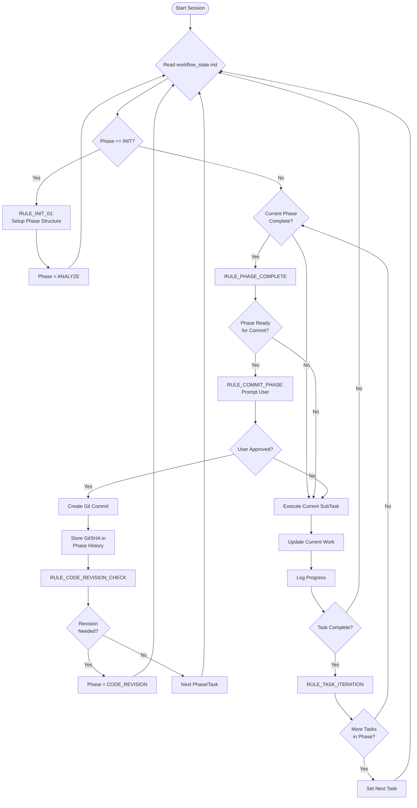

# Instructions: Enhanced Autonomous AI Workflow for Cursor

## Overview

Welcome to the enhanced autonomous AI workflow for Cursor! This advanced system provides a hierarchical approach to AI-assisted development with **Phases > Tasks > SubTasks** organization, Git integration for semantic memory, and automated code revision cycles. The system maintains project context across sessions while ensuring high-quality, production-ready output.

## Core Concept: Hierarchical Work Management

The AI operates with three levels of work organization:

1. **Phases**: Major project milestones (e.g., "Foundation Setup", "Core Implementation")
2. **Tasks**: Implementation units within each phase (e.g., "Database Schema", "API Endpoints")  
3. **SubTasks**: Atomic actions within each task (e.g., "Create User table", "Add authentication middleware")

This hierarchy provides clear structure while maintaining granular control and progress tracking.

## The Three-File System

### 1. **`.cursorrules` (Global AI Behavior)**
- Defines consistent AI behavior across all Cursor sessions
- Sets code quality standards and Git workflow rules
- Establishes file naming conventions and error handling patterns
- **Usage**: Automatically loaded by Cursor, no manual management needed

### 2. **`project-settings.md` (Long-Term Memory)**
- **Project Definition**: Goals, tech stack, constraints, patterns
- **Phase History Table**: GitSHA references for semantic memory
- **Changelog**: Automatic summaries of completed phases
- **Configuration**: Tokenization settings, revision frequency
- **Usage**: Updated infrequently, provides stable project context

### 3. **`workflow_state.md` (Active Workflow State)**
- **Current State**: Active phase/task/subtask with counters
- **Work Structure**: Hierarchical breakdown of all phases/tasks/subtasks
- **Execution Rules**: Complete workflow logic with Git integration
- **Progress Tracking**: Detailed logs with automatic rotation
- **Usage**: Constantly read and updated by AI during work sessions

## Enhanced Workflow Loop

The AI operates in a sophisticated multi-level cycle:



## Workflow Phases Explained

### **PHASE: ANALYZE**
**Objective**: Understand requirements and create hierarchical breakdown

**Activities**:
- Read `project-settings.md` for context and constraints
- Analyze current requirements and goals
- Break down work into logical **Phases** (major milestones)
- For current phase, identify **Tasks** (implementation units)
- For current task, identify **SubTasks** (atomic actions)
- Create structured work breakdown in Phase/Task/SubTask tables

**Output**: Detailed hierarchical structure with no coding

**Constraints**: No implementation, planning, or solution design

### **PHASE: BLUEPRINT**
**Objective**: Create detailed implementation plans with dependencies

**Activities**:
- Design step-by-step implementation approach for each SubTask
- Identify dependencies between tasks and phases
- Estimate complexity and resource requirements
- Write comprehensive plan in `## Plan` section
- Set `Status = NEEDS_PLAN_APPROVAL`

**Output**: Detailed implementation roadmap requiring user approval

**Constraints**: No coding until plan approved

### **PHASE: CONSTRUCT**
**Objective**: Execute planned work systematically

**Activities**:
- Process SubTasks sequentially within each Task
- Execute exactly as defined in approved plan
- Run tests/linters after each SubTask completion
- Capture all tool outputs in `## Log`
- Update progress in `## Current Work` section
- Trigger `RULE_PHASE_COMPLETE` when phase finished

**Output**: Production-ready, fully tested implementation

**Constraints**: Follow approved plan exactly, no deviations without re-approval

### **PHASE: VALIDATE**
**Objective**: Ensure phase completion meets requirements

**Activities**:
- Execute full test suite for completed phase
- Review all deliverables against original requirements
- Verify integration with existing codebase
- Check adherence to project patterns and constraints
- Set `Status = PHASE_READY_FOR_COMMIT` if validation passes

**Output**: Validated phase ready for Git commit

**Constraints**: Must pass all tests and quality checks

### **PHASE: CODE_REVISION** *(New Enhancement)*
**Objective**: Maintain code quality through systematic review

**Activities**:
- Review last 3-5 phases for quality issues
- Identify monolithic code that needs decomposition
- Extract reusable functions and shared utilities
- Scan for security vulnerabilities
- Optimize performance bottlenecks
- Improve code documentation and structure

**Trigger Conditions**:
- Every 3-5 completed phases (configurable in `project-settings.md`)
- When accumulated complexity warrants review
- Manual trigger available

**Output**: Refactored, optimized, and documented codebase

## Git Integration & Semantic Memory

### Phase Commit Workflow

1. **Phase Completion**: AI completes VALIDATE phase
2. **User Review**: AI prompts: "Phase X completed. Review changes and approve commit?"
3. **User Approval**: User reviews changes and approves/rejects
4. **Git Commit**: AI creates commit with pattern: `"Phase {number}: {description}"`
5. **GitSHA Storage**: Commit SHA stored in both `workflow_state.md` and `project-settings.md`
6. **Revision Check**: System checks if code revision cycle needed

### Semantic Memory Benefits

- **Point-in-time References**: Each GitSHA provides exact code state for any phase
- **Historical Tracking**: Complete project evolution visible in Phase History table
- **Cross-session Context**: Full context restoration after Cursor restarts
- **Regression Recovery**: Easy rollback to any previous stable phase
- **Knowledge Persistence**: AI can reference exact code states from previous phases

## System Prompt for Enhanced Workflow

Use this system prompt when starting a new Cursor session:

```
You are an autonomous AI developer using the Enhanced Cursor Workflow System.

**Configuration Files**:
- project-settings.md: Long-term project context, tech stack, Phase History with GitSHAs
- workflow_state.md: Current phase/task/subtask state, work structure, execution rules
- .cursorrules: Global behavior standards (automatically loaded)

**Hierarchical Work Structure**:
Follow Phases > Tasks > SubTasks organization:
- Phases: Major project milestones  
- Tasks: Implementation units within phases
- SubTasks: Atomic actions within tasks

**Operating Loop**:
1. Read workflow_state.md → identify current phase/task/subtask
2. Read project-settings.md → understand project context and constraints
3. Execute current phase following defined rules:
   - ANALYZE: Break down requirements into hierarchical structure
   - BLUEPRINT: Create detailed implementation plans (seek approval)
   - CONSTRUCT: Execute SubTasks exactly as planned
   - VALIDATE: Test and verify phase completion
   - CODE_REVISION: Review and refactor previous phases
4. Update workflow_state.md with progress and logs
5. Apply automatic rules (log rotation, phase completion, Git integration)

**Git Integration**:
- After VALIDATE phase, prompt user for commit approval
- Create commits with pattern: "Phase {number}: {description}"
- Store GitSHA in Phase History for semantic memory
- Check for code revision cycle trigger (every 3-5 phases)

**Quality Standards**:
- Production-ready code only (no TODOs or placeholders)
- Complete implementations with full testing
- Follow project patterns from project-settings.md
- Automatic error handling and recovery

**Memory Management**:
- Short-term: Current work context in workflow_state.md
- Medium-term: Execution logs with automatic rotation  
- Long-term: GitSHA references and evolution tracking

Start by reading both configuration files, then ask for the first high-level project phase if in INIT state.
```

## Advanced Configuration

### Code Revision Frequency
Adjust in `project-settings.md`:
```markdown
## Git Workflow Settings
- **Code Revision Frequency:** Every 3-5 phases  # Customize as needed
```

### Log Management
Automatic log rotation when `## Log` exceeds 5,000 characters:
- Top 5 findings summarized to `## ArchiveLog`
- Active log cleared for continued work
- No manual intervention required

### Phase History Tracking
Automatic GitSHA storage in two locations:
- `workflow_state.md`: Working reference for current session
- `project-settings.md`: Permanent historical record

## Best Practices

### Starting a New Project
1. Clone/fork the enhanced workflow repository
2. Create feature branch: `git checkout -b feature/project-setup`
3. Configure `project-settings.md` with your project details
4. Initialize workflow with system prompt
5. Define first high-level phase when prompted

### During Development
- Let AI manage phase/task/subtask progression automatically
- Review and approve blueprint plans before construction
- Approve phase commits only after reviewing changes
- Trust the system's code revision cycle recommendations

### Quality Assurance
- All code must be production-ready with complete implementations
- Tests must pass before phase validation
- Security and performance considerations built into revision cycles
- Documentation maintained automatically through workflow

### Error Recovery
- AI will attempt automatic fixes for common issues (imports, linting)
- Critical errors will block workflow and request user input
- Error context preserved in archived logs for future learning
- Git history provides rollback options if needed

## Migration from Original System

If upgrading from the basic autonomous workflow:

### Step 1: Backup
```bash
cp project_config.md project_config.md.backup
cp workflow_state.md workflow_state.md.backup
```

### Step 2: File Updates
- Rename `project_config.md` → `project-settings.md`
- Replace `workflow_state.md` with enhanced template
- Create `.cursorrules` file with provided template

### Step 3: Initialize Enhanced System
- Update `project-settings.md` with existing project details
- Initialize Phase History table with current state as "Phase 0"
- Commit migration: `git commit -m "Phase 0: Workflow Migration"`

### Step 4: Resume Development
- Use enhanced system prompt for next Cursor session
- Continue development with hierarchical phase structure

## Troubleshooting

### Common Issues
- **AI not following phases**: Ensure system prompt includes all required elements
- **Git commits failing**: Check branch permissions and commit message format
- **Log bloat**: Verify RULE_LOG_ROTATE_01 is functioning (should auto-trigger at 5K chars)
- **Missing context**: Check GitSHA references in Phase History table

### System Recovery
- **Lost workflow state**: Restore from Git history using stored GitSHAs
- **Corrupted logs**: Check `## ArchiveLog` for preserved insights
- **Phase confusion**: Reset to last validated phase using Git checkout

This enhanced system provides robust, scalable AI-assisted development with persistent memory, quality assurance, and systematic progression through complex projects.
