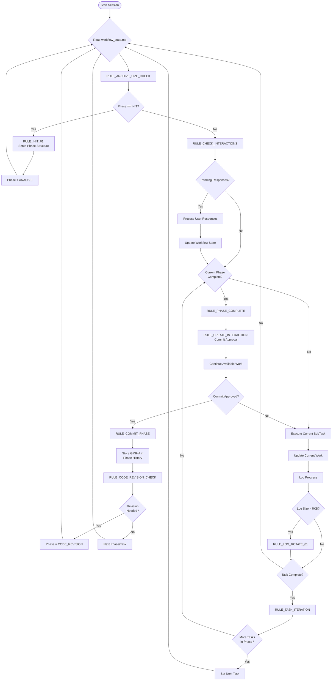

# Instructions: Enhanced Autonomous AI Workflow for Cursor

## Overview

Welcome to the enhanced autonomous AI workflow for Cursor! This advanced system provides a hierarchical approach to AI-assisted development with **Phases > Tasks > SubTasks** organization, **non-blocking user interaction system**, **automatic archiving capabilities**, Git integration for semantic memory, and automated code revision cycles. The system maintains project context across sessions while ensuring high-quality, production-ready output.

## Core Concept: Hierarchical Work Management

The AI operates with three levels of work organization:

1. **Phases**: Major project milestones (e.g., "Foundation Setup", "Core Implementation")
2. **Tasks**: Implementation units within each phase (e.g., "Database Schema", "API Endpoints")  
3. **SubTasks**: Atomic actions within each task (e.g., "Create User table", "Add authentication middleware")

This hierarchy provides clear structure while maintaining granular control and progress tracking.

## The Enhanced Five-File System

### 1. **`.cursorrules` (Global AI Behavior)**
- Defines consistent AI behavior across all Cursor sessions
- Sets code quality standards and Git workflow rules
- Establishes file naming conventions and error handling patterns
- **Usage**: Automatically loaded by Cursor, no manual management needed

### 2. **`.cursor/rules/project-settings.md` (Long-Term Memory)**
- **Project Definition**: Goals, tech stack, constraints, patterns
- **Phase History Table**: GitSHA references for semantic memory
- **Changelog**: Automatic summaries of completed phases
- **Configuration**: Tokenization settings, revision frequency, archiving thresholds
- **Usage**: Updated infrequently, provides stable project context

### 3. **`.cursor/workflow_state.md` (Active Workflow State)**
- **Current State**: Active phase/task/subtask with counters
- **Work Structure**: Hierarchical breakdown of all phases/tasks/subtasks
- **User Interactions**: Non-blocking interaction management
- **Execution Rules**: Complete workflow logic with Git integration
- **Progress Tracking**: Detailed logs with automatic rotation and archiving
- **Usage**: Constantly read and updated by AI during work sessions

### 4. **`.cursor/tools/user-interaction-system.md` (Non-Blocking User Interface)** *(New)*
- **Interaction Management**: Tool-call based user prompt system
- **Response Processing**: Automatic handling of user input without workflow interruption
- **Timeout Handling**: Configurable defaults and timeout management
- **Integration Rules**: Seamless workflow continuation after user responses
- **Usage**: Referenced for interaction patterns, updated with new interaction types

### 5. **`.cursor/tools/archiving-system.md` (Automatic File Management)** *(New)*
- **Archive Configuration**: Size thresholds, retention policies, directory structure
- **Recovery Operations**: Context restoration and merge capabilities  
- **Performance Optimization**: File size management for optimal editing
- **Archive Index**: Centralized tracking of all archived content
- **Usage**: Automatic operation with manual recovery options

## Enhanced Workflow Loop

The AI operates in a sophisticated multi-level cycle with non-blocking user interactions:



## Key Enhancements

### Non-Blocking User Interaction System

**Problem Solved**: Traditional workflows stop execution when user input is needed, breaking the tool chain and reducing efficiency.

**Solution**: Tool-call based interaction system that allows workflow to continue while waiting for user responses.

**Key Features**:
- **Parallel Processing**: AI continues available work while waiting for user input
- **Timeout Management**: Configurable timeouts with reasonable defaults
- **Response Methods**: Direct table editing, tool calls, or natural language responses
- **Context Preservation**: Full audit trail of all user decisions

**Example Interaction Flow**:
1. AI completes Phase 3, needs commit approval
2. Creates interaction: `INT001 | COMMIT_APPROVAL | "Phase 3 completed. Ready to commit?" | PENDING`
3. Continues with Phase 4 planning while waiting
4. User responds: `approve` in Response column
5. AI processes approval and executes commit
6. Workflow continues seamlessly

### Automatic Archiving System

**Problem Solved**: Files like `.cursor/workflow_state.md` and `.cursor/rules/project-settings.md` become too large for efficient editing, causing performance issues.

**Solution**: Intelligent archiving system that moves large files to `.cursor/archive` while preserving essential context.

**Key Features**:
- **Size-Based Triggers**: Automatic archiving when files exceed thresholds
- **Context Preservation**: GitSHA references and phase contexts maintained
- **Recovery Operations**: Full context restoration when needed
- **Performance Optimization**: Working files remain optimally sized

**Example Archiving Flow**:
1. `.cursor/workflow_state.md` grows to 15,247 characters (threshold: 15,000)
2. System creates `ARC-WF-20250116-001` in `.cursor/archive/workflow_state/`
3. Original file truncated to essential structure with archive reference
4. AI continues with optimal file size
5. Full context recoverable when needed

## Workflow Phases Explained

### **PHASE: ANALYZE**
**Objective**: Understand requirements and create hierarchical breakdown

**Activities**:
- Read `.cursor/rules/project-settings.md` for context and constraints
- Analyze current requirements and goals
- Break down work into logical **Phases** (major milestones)
- For current phase, identify **Tasks** (implementation units)
- For current task, identify **SubTasks** (atomic actions)
- Create structured work breakdown in Phase/Task/SubTask tables

**Output**: Detailed hierarchical structure with no coding

**Constraints**: No implementation, planning, or solution design

### **PHASE: BLUEPRINT**
**Objective**: Create detailed implementation plans with dependencies

**Activities**:
- Design step-by-step implementation approach for each SubTask
- Identify dependencies between tasks and phases
- Estimate complexity and resource requirements
- Write comprehensive plan in `## Plan` section
- Create non-blocking approval interaction via `RULE_CREATE_INTERACTION`

**Output**: Detailed implementation roadmap with non-blocking approval request

**Constraints**: No coding until plan approved via interaction system

### **PHASE: CONSTRUCT**
**Objective**: Execute planned work systematically

**Activities**:
- Process SubTasks sequentially within each Task
- Execute exactly as defined in approved plan
- Run tests/linters after each SubTask completion
- Capture all tool outputs in `## Log`
- Update progress in `## Current Work` section
- Trigger `RULE_PHASE_COMPLETE` when phase finished

**Output**: Production-ready, fully tested implementation

**Constraints**: Follow approved plan exactly, no deviations without re-approval

### **PHASE: VALIDATE**
**Objective**: Ensure phase completion meets requirements

**Activities**:
- Execute full test suite for completed phase
- Review all deliverables against original requirements
- Verify integration with existing codebase
- Check adherence to project patterns and constraints
- Create non-blocking commit approval interaction

**Output**: Validated phase with non-blocking commit request

**Constraints**: Must pass all tests and quality checks

### **PHASE: CODE_REVISION** *(Enhanced)*
**Objective**: Maintain code quality through systematic review

**Activities**:
- Review last 3-5 phases for quality issues
- Identify monolithic code that needs decomposition
- Extract reusable functions and shared utilities
- Scan for security vulnerabilities
- Optimize performance bottlenecks
- Improve code documentation and structure

**Trigger Conditions**:
- Every 3-5 completed phases (configurable in `project-settings.md`)
- When accumulated complexity warrants review
- Manual trigger available

**Output**: Refactored, optimized, and documented codebase

## Enhanced Git Integration & Semantic Memory

### Non-Blocking Phase Commit Workflow

1. **Phase Completion**: AI completes VALIDATE phase
2. **Create Interaction**: AI creates commit approval interaction (`RULE_CREATE_INTERACTION`)
3. **Continue Work**: AI proceeds with other available tasks while waiting
4. **User Response**: User approves/rejects via interaction system
5. **Process Response**: AI handles response through `RULE_CHECK_INTERACTIONS`
6. **Execute Commit**: If approved, create commit with pattern: `"Phase {number}: {description}"`
7. **GitSHA Storage**: Commit SHA stored in both `workflow_state.md` and `project-settings.md`
8. **Revision Check**: System checks if code revision cycle needed

### Semantic Memory Benefits

- **Point-in-time References**: Each GitSHA provides exact code state for any phase
- **Historical Tracking**: Complete project evolution visible in Phase History table
- **Cross-session Context**: Full context restoration after Cursor restarts
- **Regression Recovery**: Easy rollback to any previous stable phase
- **Knowledge Persistence**: AI can reference exact code states from previous phases
- **Archive Integration**: Historical context preserved even after archiving

## System Prompt for Enhanced Workflow

Use this system prompt when starting a new Cursor session:

```
You are an autonomous AI developer using the Enhanced Cursor Workflow System with non-blocking user interactions and automatic archiving.

**Configuration Files**:
- .cursor/rules/project-settings.md: Agility CMS project context, tech stack, Phase History with GitSHAs, archiving configuration
- .cursor/workflow_state.md: Current phase/task/subtask state, work structure, execution rules, user interactions
- .cursor/tools/user-interaction-system.md: Non-blocking interaction patterns and response processing
- .cursor/tools/archiving-system.md: Automatic file management and recovery operations
- .cursor/libs/: Agility CMS SDK documentation (fetch, management, sync, apps, next)
- .cursorrules: Global behavior standards (automatically loaded)

**Hierarchical Work Structure**:
Follow Phases > Tasks > SubTasks organization:
- Phases: Major project milestones  
- Tasks: Implementation units within phases
- SubTasks: Atomic actions within tasks

**Enhanced Operating Loop**:
1. Read .cursor/workflow_state.md → identify current phase/task/subtask and check for pending interactions
2. Check archive sizes via RULE_ARCHIVE_SIZE_CHECK → archive if needed
3. Process pending user interactions via RULE_CHECK_INTERACTIONS
4. Read .cursor/rules/project-settings.md → understand project context and constraints
5. Execute current phase following defined rules:
   - ANALYZE: Break down requirements into hierarchical structure
   - BLUEPRINT: Create detailed implementation plans (create non-blocking approval interaction)
   - CONSTRUCT: Execute SubTasks exactly as planned
   - VALIDATE: Test and verify phase completion (create non-blocking commit interaction)
   - CODE_REVISION: Review and refactor previous phases
6. Update .cursor/workflow_state.md with progress and logs
7. Apply automatic rules (log rotation, phase completion, archiving, Git integration)
8. Continue with available work while waiting for user responses

**Non-Blocking User Interactions**:
- Create interactions via RULE_CREATE_INTERACTION for all user input needs
- Never stop workflow execution waiting for user responses
- Continue with other available tasks while interactions are pending
- Process responses through RULE_CHECK_INTERACTIONS periodically
- Support multiple pending interactions simultaneously

**Automatic Archiving**:
- Monitor file sizes against configured thresholds
- Archive automatically when limits exceeded
- Preserve GitSHA references and phase contexts in archives
- Maintain working files at optimal sizes for editing
- Support full context recovery when needed

**Git Integration**:
- After VALIDATE phase, create non-blocking commit approval interaction
- Continue other work while waiting for approval
- Create commits with pattern: "Phase {number}: {description}" when approved
- Store GitSHA in Phase History for semantic memory
- Check for code revision cycle trigger (every 3-5 phases)

**Quality Standards**:
- Production-ready code only (no TODOs or placeholders)
- Complete implementations with full testing
- Follow project patterns from project-settings.md
- Automatic error handling and recovery

**Memory Management**:
- Short-term: Current work context in workflow_state.md
- Medium-term: Execution logs with automatic rotation and archiving
- Long-term: GitSHA references, evolution tracking, and archived context

Start by reading all configuration files, checking for pending interactions, verifying archive status, then ask for the first high-level project phase if in INIT state.
```

## Advanced Configuration

### User Interaction System
Adjust in `project-settings.md`:
```markdown
## User Interaction System
- **Interaction Mode:** Non-blocking tool-call based
- **Response Timeout:** 300 seconds (5 minutes)  # Customize per interaction type
- **Auto-proceed on Timeout:** Configure per interaction type
```

### Archiving System
Adjust in `project-settings.md`:
```markdown
## Archiving System Settings
- **Archive Directory:** .cursor/archive/
- **File Size Threshold:** 15,000 characters  # Customize per file type
- **Archive Trigger:** Automatic on file size or manual
```

### Code Revision Frequency
Adjust in `project-settings.md`:
```markdown
## Git Workflow Settings
- **Code Revision Frequency:** Every 3-5 phases  # Customize as needed
```

### Log Management
Automatic log rotation when `## Log` exceeds 5,000 characters:
- Top 5 findings summarized to `## ArchiveLog`
- Large logs automatically archived to `.cursor/archive/logs/`
- Active log cleared for continued work
- No manual intervention required

### Phase History Tracking
Automatic GitSHA storage in multiple locations:
- `workflow_state.md`: Working reference for current session
- `project-settings.md`: Permanent historical record
- Archive files: Context-preserved references

## Best Practices

### Starting a New Project
1. Clone/fork the enhanced workflow repository
2. Create feature branch: `git checkout -b feature/project-setup`
3. Configure `project-settings.md` with your project details
4. Initialize workflow with enhanced system prompt
5. Define first high-level phase when prompted

### During Development
- Let AI manage phase/task/subtask progression automatically
- Respond to interactions through the table system, tool calls, or natural language
- AI will continue other work while waiting for your responses
- Approve phase commits by responding to commit approval interactions
- Trust the system's automatic archiving and code revision cycle recommendations

### User Interaction Best Practices
- Respond to interactions promptly for optimal workflow flow
- Use clear responses: "approve", "reject", "modify", etc.
- Add comments in interaction responses for complex decisions
- Review interaction history for decision audit trail

### Archive Management
- Trust automatic archiving - it preserves all context
- Use recovery operations when historical context needed
- Monitor archive index for system health
- Archive manually before major changes if needed

### Quality Assurance
- All code must be production-ready with complete implementations
- Tests must pass before phase validation
- Security and performance considerations built into revision cycles
- Documentation maintained automatically through workflow

### Error Recovery
- AI will attempt automatic fixes for common issues (imports, linting)
- Critical errors will create interactions requesting user input
- Error context preserved in archived logs for future learning
- Git history provides rollback options if needed
- Archive system provides additional recovery points

## Migration from Previous Systems

If upgrading from the basic autonomous workflow or manifest.md systems:

### Step 1: Backup
```bash
cp project_config.md project_config.md.backup
cp workflow_state.md workflow_state.md.backup
cp manifest.md manifest.md.backup  # If exists
```

### Step 2: File Updates
- Rename `project_config.md` → `project-settings.md`
- Replace `workflow_state.md` with enhanced template
- Create `user-interaction-system.md` with provided template
- Create `archiving-system.md` with provided template
- Create `.cursorrules` file with provided template

### Step 3: Initialize Enhanced System
- Update `project-settings.md` with existing project details
- Add archiving and interaction system configurations
- Initialize Phase History table with current state as "Phase 0"
- Commit migration: `git commit -m "Phase 0: Enhanced Workflow Migration"`

### Step 4: Resume Development
- Use enhanced system prompt for next Cursor session
- Continue development with hierarchical phase structure
- Experience non-blocking interactions and automatic archiving

## Troubleshooting

### Common Issues
- **AI not following phases**: Ensure system prompt includes all enhanced elements
- **Git commits failing**: Check branch permissions and commit message format
- **Log bloat**: Archive system should auto-trigger (check RULE_ARCHIVE_SIZE_CHECK)
- **Missing context**: Check archive references and GitSHA tracking
- **Stuck on user input**: Check pending interactions table for responses

### Interaction System Issues
- **Interactions not processed**: Verify RULE_CHECK_INTERACTIONS is running
- **Timeout issues**: Adjust timeout settings in project-settings.md
- **Response format errors**: Use clear, simple responses (approve/reject/modify)
- **Multiple pending interactions**: Prioritize by importance, AI will handle sequencing

### Archive System Issues
- **Archive failures**: Check .cursor/archive directory permissions
- **Context recovery issues**: Verify archive integrity and references
- **Performance problems**: Check if archiving thresholds need adjustment
- **Missing archived content**: Check archive index for references

### System Recovery
- **Lost workflow state**: Restore from Git history using stored GitSHAs or archive references
- **Corrupted interactions**: Check interaction history in archived files
- **Archive corruption**: Use recovery scripts in .cursor/recovery-scripts/
- **Phase confusion**: Reset to last validated phase using Git checkout or archive recovery

This enhanced system provides robust, scalable AI-assisted development with persistent memory, non-blocking user interactions, automatic file management, quality assurance, and systematic progression through complex projects of any size.
