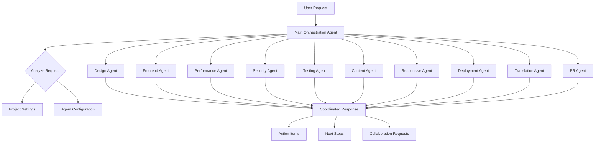

# Kairo Multi-Agent Development Platform


> **Intelligent AI Agent Orchestration for Modern Development**

Transform your development workflow with Kairo's multi-agent system, featuring a native desktop app built with Electron.

## 🚀 Quick Start

```bash
# Clone and setup
git clone https://github.com/your-org/kairo.git
cd kairo
npm run setup

# Start desktop app
npm run app:dev

# Or start web version
npm run dev
```

## 📋 Available Commands

### Development
```bash
npm run dev         # Start web development server
npm run app:dev     # Launch desktop app in development
npm run build       # Build web application
npm run app:build   # Build desktop app for distribution
npm run app:pack    # Package desktop app
```

### Utilities
```bash
npm run lint        # Run ESLint across all packages
npm run setup       # Install all dependencies
```

## ✨ Key Features

- **🤖 Multi-Agent System**: Specialized agents for design, frontend, performance, security, testing, and more
- **🖥️ Native Desktop App**: Built with Electron for seamless development experience  
- **🌐 Web Interface**: Full-featured browser-based interface
- **⚡ Real-time Orchestration**: Intelligent agent coordination and task delegation
- **🔧 Project Integration**: Automatic test project detection and management
- **🎨 Modern UI**: Beautiful, responsive interface with drag-and-drop support

## 🏗️ Project Structure

Kairo is built as a **TurboRepo monorepo** that efficiently manages multiple interconnected applications and shared packages. This architecture enables fast builds, intelligent caching, and seamless code sharing across the entire platform.

### **TurboRepo Architecture**

```
kairo/                           # Root monorepo workspace
├── kairo-platform/             # Main platform monorepo
│   ├── apps/                   # Applications (Next.js apps)
│   │   ├── web/                # Main Kairo web interface
│   │   ├── docs/               # Documentation site  
│   │   └── agents/             # Agent system implementation
│   ├── packages/               # Shared packages and utilities
│   │   ├── ui/                 # Shared UI components
│   │   ├── eslint-config/      # Shared ESLint configurations
│   │   └── typescript-config/  # Shared TypeScript configurations
│   ├── lib/                    # Core libraries and providers
│   │   ├── ai-providers.ts     # AI provider integrations
│   │   └── project-manager.ts  # Project management utilities
│   ├── electron/               # Electron desktop app
│   ├── assets/                 # Icons and static assets
│   ├── turbo.json             # TurboRepo configuration
│   └── package.json           # Platform workspace configuration
├── agents/                     # Agent configuration files
└── package.json               # Root workspace configuration
```

### **How TurboRepo Works Here**

- **🚀 Parallel Execution**: Multiple apps can be built and developed simultaneously
- **📦 Shared Packages**: Common UI components, configs, and utilities are shared across apps
- **⚡ Intelligent Caching**: TurboRepo caches build outputs for faster subsequent builds
- **🔄 Dependency Management**: Automatic dependency resolution between packages
- **🎯 Selective Builds**: Only rebuild what has changed

### **Key Applications**

| Application | Purpose | Port | Command |
|-------------|---------|------|---------|
| **Web** | Main Kairo interface with agent orchestration | 3001 | `npm run dev` |
| **Docs** | Documentation and guides | 4001 | `cd apps/docs && npm run dev` |
| **Agents** | Agent system backend | - | `cd apps/agents && npm run dev` |
| **Desktop** | Electron app wrapper | - | `npm run app:dev` |

### **Shared Packages**

- **`@repo/ui`**: Shared React components (buttons, cards, etc.)
- **`@repo/eslint-config`**: Consistent linting rules across all apps
- **`@repo/typescript-config`**: Shared TypeScript configurations

### **TurboRepo Benefits for Kairo**

1. **Agent Development**: Each agent can be developed independently while sharing common utilities
2. **UI Consistency**: Shared component library ensures consistent design across all interfaces  
3. **Fast Builds**: Only changed packages are rebuilt, making development faster
4. **Type Safety**: Shared TypeScript configs ensure consistent typing across the platform
5. **Scalability**: Easy to add new apps or agents without restructuring

## 🎯 Agent Architecture

Kairo features a sophisticated multi-agent system with specialized capabilities:

### Core Agents
- **Main Orchestration Agent**: Coordinates all other agents and manages workflow
- **Frontend Agent**: React/Next.js development and optimization
- **Design Agent**: UI/UX design and component architecture
- **Performance Agent**: Code optimization and performance monitoring
- **Security Agent**: Security analysis and vulnerability detection
- **Testing Agent**: Test generation and quality assurance
- **Content Agent**: Documentation and content management
- **Responsive Agent**: Mobile and responsive design optimization
- **Deployment Agent**: CI/CD and deployment automation
- **Translation Agent**: Internationalization and localization
- **PR Agent**: Pull request analysis and code review

### Agent Orchestration Flow



## 🔧 Configuration

### Project Settings
Configure your agents through the settings interface:
- **Agent Models**: Choose AI models for each agent (Claude, GPT, Gemini)
- **API Keys**: Configure provider API keys
- **Orchestration Mode**: Intelligent, manual, or sequential
- **Project Type**: Web app, mobile app, or custom

### Desktop App Features
- **Native Performance**: Optimized Electron app with custom icons
- **Project Detection**: Automatically detects and manages test projects
- **Integrated Development**: Seamless switching between Kairo and your projects
- **Modern Interface**: Clean, draggable interface with splash screen

## 🚀 Getting Started

### Prerequisites
- Node.js 18+ and npm
- Git for version control
- Optional: API keys for AI providers (OpenAI, Anthropic, Google)

### Installation Steps

1. **Clone the repository**
   ```bash
   git clone https://github.com/your-org/kairo.git
   cd kairo
   ```

2. **Install dependencies**
   ```bash
   npm run setup
   ```

3. **Configure API keys** (optional)
   - Open the desktop app: `npm run app:dev`
   - Click Settings and add your API keys

4. **Start developing**
   - Desktop app: `npm run app:dev`
   - Web interface: `npm run dev`

## 📚 Documentation

- [Agent Architecture](./kairo-platform/apps/docs/) - Deep dive into the multi-agent system
- [API Reference](./kairo-platform/lib/) - Core libraries and provider integration
- [Desktop App Guide](./kairo-platform/electron/) - Electron app development

## 🔗 Quick Links

- **Desktop App**: `npm run app:dev` - Native development experience
- **Web Interface**: `npm run dev` - Browser-based interface  
- **Documentation**: `cd kairo-platform/apps/docs && npm run dev`
- **Agent System**: `cd kairo-platform/apps/agents && npm run dev`

## 🛠️ Development Workflow

1. Start the desktop app with `npm run app:dev`
2. Configure your agents and API keys
3. Create or connect your project
4. Use the orchestration system to coordinate development tasks
5. Deploy with integrated deployment agents

## 🤝 Contributing

We welcome contributions! Please see our contributing guidelines and feel free to submit issues and pull requests.

## 📄 License

This project is licensed under the MIT License - see the LICENSE file for details.
