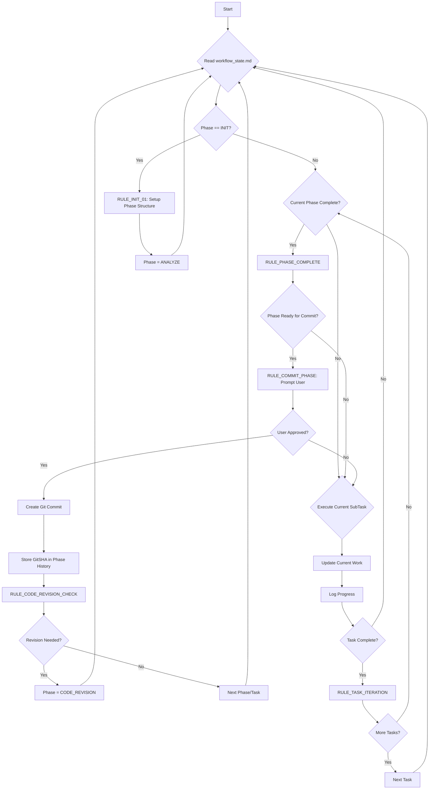
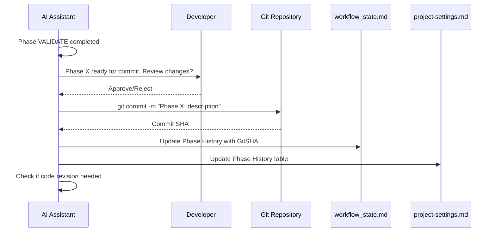

# Agility CMS Cursor Workflow Starter

<div align="center">
  
  <p><em>The ultimate Cursor AI starter for building high-performance websites with Agility CMS</em></p>
</div>

## Overview

This repository provides a specialized autonomous AI workflow system for building frontend websites with **Agility CMS**. It includes comprehensive SDK documentation, framework-specific tooling, and an enhanced Cursor workflow with hierarchical **Phases > Tasks > SubTasks** organization, **non-blocking user interaction system**, and **automatic archiving capabilities**.

**🚀 Agility CMS Ready**: Includes complete SDK documentation and best practices for all Agility CMS development scenarios - from simple websites to complex applications.

**🔧 Drop-In Ready**: Organized following Cursor IDE best practices with all configuration files properly placed in `.cursor/` directories for seamless integration.

## Key Features

### 🚀 **Agility CMS Specialized Tooling**
- Complete SDK documentation for all development scenarios
- Pre-configured best practices for content fetching and management
- TypeScript content model definitions and optimization patterns

### 🔄 **Non-Blocking User Interactions**
- AI continues working while waiting for user input
- Tool-call based interaction system
- Multiple concurrent interactions supported
- Configurable timeouts with reasonable defaults

### 📦 **Automatic Archiving System**
- Intelligent file size management
- Automatic archiving when files exceed thresholds
- Full context preservation with GitSHA references
- Easy recovery and restoration operations

### 🎯 **Hierarchical Work Management**
- **Phases**: Major project milestones
- **Tasks**: Implementation units within phases
- **SubTasks**: Atomic actions within tasks

### 🧠 **Semantic Memory**
- GitSHA references for point-in-time recovery
- Cross-session context preservation
- Historical tracking with archived context

### ⚡ **Automated Quality Assurance**
- Production-ready code standards with Agility CMS best practices
- Automated code revision cycles
- Continuous testing and validation

### 🔧 **Drop-In Architecture**
- Follows Cursor IDE best practices for `.cursor/rules/` organization
- Clean project root with only essential working files
- Configuration files properly scoped for team collaboration
- Examples organized in `.cursor/rules/examples/` directory
- **File Format**: Uses standard `.md` format for maximum compatibility with editors, tools, and LLMs

### 📊 **LLM Performance Optimization**
- **30 focused files** (150-400 lines each) for optimal context windows
- **Semantic headers** with descriptive titles for better search
- **Cross-references** linking related concepts across files
- **Metadata tags** for improved AI assistant navigation
- **File index** (`.cursor/libs/file-index.md`) for comprehensive file mapping
- **YAML frontmatter** on key files for enhanced LLM understanding and categorization
- **Frontmatter template** (`.cursor/libs/frontmatter-template.md`) for consistent metadata structure

### 🎨 **Figma MCP Integration**

The Figma MCP (Model Context Protocol) integration enables seamless design-to-code workflows for Agility CMS projects, bridging the gap between design and development.

### **Core Capabilities**

#### **Design Token Extraction**
```typescript
// Automatic extraction of design tokens from Figma
interface FigmaDesignTokens {
  colors: Record<string, string>;
  typography: Record<string, TypographyToken>;
  spacing: Record<string, string>;
  breakpoints: Record<string, string>;
}

// Integration with Tailwind CSS for Agility CMS projects
const figmaTokens = await figmaMCP.extractDesignTokens(figmaFileId);
const tailwindConfig = generateTailwindConfig(figmaTokens);
```

#### **Component Generation**
```typescript
// Generate React components from Figma designs
const componentCode = await figmaMCP.generateComponent({
  figmaNodeId: 'component-id',
  framework: 'nextjs',
  agilityIntegration: true,
  outputPath: './components/agility-modules/'
});

// Automatic AgilityPic integration for images
const optimizedComponent = await figmaMCP.optimizeForAgility(componentCode, {
  imageOptimization: true,
  responsiveImages: true,
  agilityPicComponent: true
});
```

### **Workflow Integration**

#### **Phase-Based Design Implementation**
```yaml
Phase 1: Design Analysis
  - Extract design tokens from Figma
  - Generate component structure
  - Create Agility CMS content models

Phase 2: Component Development
  - Generate base React components
  - Integrate with Agility CMS data fetching
  - Implement responsive design patterns

Phase 3: Content Integration
  - Map Figma components to Agility modules
  - Configure dynamic content areas
  - Implement preview mode support
```

#### **Asset Pipeline**
```typescript
// Automatic asset optimization for Agility CMS
const assetPipeline = {
  // Extract and optimize images from Figma
  extractImages: async (figmaFileId: string) => {
    const images = await figmaMCP.extractImages(figmaFileId);
    return await Promise.all(images.map(img => 
      optimizeForAgilityPic(img, {
        formats: ['webp', 'avif', 'jpg'],
        sizes: [320, 640, 768, 1024, 1280, 1920],
        quality: 85
      })
    ));
  },

  // Generate responsive image configurations
  generateImageConfigs: (images: OptimizedImage[]) => {
    return images.map(img => ({
      url: img.url,
      width: img.width,
      height: img.height,
      alt: img.alt || '',
      agilityPicProps: {
        sizes: '(max-width: 768px) 100vw, (max-width: 1200px) 50vw, 33vw',
        priority: img.priority || false
      }
    }));
  }
};
```

### **Design System Synchronization**

#### **Component Mapping**
```typescript
// Map Figma components to Agility modules
const componentMapping = {
  'HeroSection': {
    figmaComponentId: 'hero-component-id',
    agilityModule: 'Hero',
    contentModel: {
      title: 'text',
      subtitle: 'text',
      backgroundImage: 'media',
      ctaButton: 'object'
    }
  },
  'ContentBlock': {
    figmaComponentId: 'content-block-id',
    agilityModule: 'RichTextArea',
    contentModel: {
      content: 'html',
      alignment: 'text'
    }
  }
};

// Automatic component updates
await figmaMCP.syncComponents(componentMapping, {
  updateOnDesignChange: true,
  preserveContentLogic: true,
  generatePropTypes: true
});
```

---

## 🧪 Playwright MCP Integration

Playwright MCP integration provides comprehensive testing capabilities specifically designed for Agility CMS applications, ensuring content delivery, performance, and user experience quality.

### **Core Testing Capabilities**

## 🎨 Comprehensive Figma MCP Integration

The Figma MCP (Model Context Protocol) integration enables seamless design-to-code workflows for Agility CMS projects, bridging the gap between design and development with automated component generation and asset optimization.

### **Design Token Extraction**
```typescript
// Automatic extraction of design tokens from Figma
interface FigmaDesignTokens {
  colors: Record<string, string>;
  typography: Record<string, TypographyToken>;
  spacing: Record<string, string>;
  breakpoints: Record<string, string>;
}

// Integration with Tailwind CSS for Agility CMS projects
const figmaTokens = await figmaMCP.extractDesignTokens(figmaFileId);
const tailwindConfig = generateTailwindConfig(figmaTokens);
```

### **Component Generation**
```typescript
// Generate React components from Figma designs
const componentCode = await figmaMCP.generateComponent({
  figmaNodeId: 'component-id',
  framework: 'nextjs',
  agilityIntegration: true,
  outputPath: './components/agility-modules/'
});

// Automatic AgilityPic integration for images
const optimizedComponent = await figmaMCP.optimizeForAgility(componentCode, {
  imageOptimization: true,
  responsiveImages: true,
  agilityPicComponent: true
});
```

### **Asset Pipeline**
```typescript
// Automatic asset optimization for Agility CMS
const assetPipeline = {
  // Extract and optimize images from Figma
  extractImages: async (figmaFileId: string) => {
    const images = await figmaMCP.extractImages(figmaFileId);
    return await Promise.all(images.map(img => 
      optimizeForAgilityPic(img, {
        formats: ['webp', 'avif', 'jpg'],
        sizes: [320, 640, 768, 1024, 1280, 1920],
        quality: 85
      })
    ));
  },

  // Generate responsive image configurations
  generateImageConfigs: (images: OptimizedImage[]) => {
    return images.map(img => ({
      url: img.url,
      width: img.width,
      height: img.height,
      alt: img.alt || '',
      agilityPicProps: {
        sizes: '(max-width: 768px) 100vw, (max-width: 1200px) 50vw, 33vw',
        priority: img.priority || false
      }
    }));
  }
};
```

### **Component Mapping**
```typescript
// Map Figma components to Agility modules
const componentMapping = {
  'HeroSection': {
    figmaComponentId: 'hero-component-id',
    agilityModule: 'Hero',
    contentModel: {
      title: 'text',
      subtitle: 'text',
      backgroundImage: 'media',
      ctaButton: 'object'
    }
  },
  'ContentBlock': {
    figmaComponentId: 'content-block-id',
    agilityModule: 'RichTextArea',
    contentModel: {
      content: 'html',
      alignment: 'text'
    }
  }
};

// Automatic component updates
await figmaMCP.syncComponents(componentMapping, {
  updateOnDesignChange: true,
  preserveContentLogic: true,
  generatePropTypes: true
});
```

---

## 🧪 Comprehensive Playwright MCP Integration

Playwright MCP integration provides comprehensive testing capabilities specifically designed for Agility CMS applications, ensuring content delivery, performance, and user experience quality.

### **Content Validation Testing**
```typescript
// Test Agility CMS content fetching and rendering
import { test, expect } from '@playwright/test';

test.describe('Agility CMS Content Tests', () => {
  test('should render dynamic content correctly', async ({ page }) => {
    await page.goto('/blog');
    
    // Test content list rendering
    const blogPosts = await page.locator('[data-agility-content="posts"]');
    await expect(blogPosts).toBeVisible();
    
    // Validate content structure
    const firstPost = blogPosts.first();
    await expect(firstPost.locator('h2')).toBeVisible();
    await expect(firstPost.locator('[data-agility-field="excerpt"]')).toBeVisible();
  });

  test('should handle content updates in preview mode', async ({ page }) => {
    // Test preview mode functionality
    await page.goto('/api/preview?secret=preview-secret&slug=/test-page');
    await expect(page.locator('[data-agility-preview="true"]')).toBeVisible();
  });
});
```

### **Performance Testing**
```typescript
// Automated performance audits for Agility CMS sites
test.describe('Performance Tests', () => {
  test('should meet Core Web Vitals thresholds', async ({ page }) => {
    await page.goto('/');
    
    // Measure and validate Core Web Vitals
    const vitals = await page.evaluate(() => {
      return new Promise((resolve) => {
        import('web-vitals').then(({ getCLS, getFID, getLCP }) => {
          const vitals = {};
          getCLS((metric) => vitals.cls = metric.value);
          getFID((metric) => vitals.fid = metric.value);
          getLCP((metric) => {
            vitals.lcp = metric.value;
            resolve(vitals);
          });
        });
      });
    });
    
    expect(vitals.cls).toBeLessThan(0.1);
    expect(vitals.fid).toBeLessThan(100);
    expect(vitals.lcp).toBeLessThan(2500);
  });

  test('should optimize AgilityPic image loading', async ({ page }) => {
    await page.goto('/gallery');
    
    // Test image optimization
    const images = await page.locator('img[data-agility-pic]');
    const imageCount = await images.count();
    
    for (let i = 0; i < imageCount; i++) {
      const img = images.nth(i);
      await expect(img).toHaveAttribute('loading', 'lazy');
      await expect(img).toHaveAttribute('decoding', 'async');
    }
  });
});
```

### **Visual Regression Testing**
```typescript
// Screenshot comparison for design consistency
test.describe('Visual Regression Tests', () => {
  test('should maintain visual consistency across deployments', async ({ page }) => {
    await page.goto('/');
    
    // Full page screenshot
    await expect(page).toHaveScreenshot('homepage.png', {
      fullPage: true,
      threshold: 0.2
    });
  });

  test('should render Agility modules consistently', async ({ page }) => {
    await page.goto('/components-showcase');
    
    // Test individual module rendering
    const modules = await page.locator('[data-agility-module]');
    const moduleCount = await modules.count();
    
    for (let i = 0; i < moduleCount; i++) {
      const module = modules.nth(i);
      const moduleName = await module.getAttribute('data-agility-module');
      
      await expect(module).toHaveScreenshot(`module-${moduleName}.png`, {
        threshold: 0.1
      });
    }
  });
});
```

### **Multi-language Testing**
```typescript
// Test multi-language content switching
test.describe('Multi-language Support', () => {
  ['en-us', 'fr-ca', 'es-mx'].forEach(locale => {
    test(`should render content in ${locale}`, async ({ page }) => {
      await page.goto(`/${locale}`);
      
      // Validate locale-specific content
      const htmlLang = await page.getAttribute('html', 'lang');
      expect(htmlLang).toBe(locale);
      
      // Test navigation in correct language
      const navigation = await page.locator('[data-agility-nav]');
      await expect(navigation).toBeVisible();
    });
  });
});
```

### **CI/CD Integration**
```typescript
// Playwright configuration for Agility CMS projects
// playwright.config.ts
import { defineConfig } from '@playwright/test';

export default defineConfig({
  testDir: './tests',
  projects: [
    {
      name: 'agility-content-tests',
      testMatch: '**/content/*.spec.ts',
      use: {
        baseURL: process.env.AGILITY_PREVIEW_URL || 'http://localhost:3000',
      }
    },
    {
      name: 'agility-performance-tests',
      testMatch: '**/performance/*.spec.ts',
      use: {
        baseURL: process.env.AGILITY_PRODUCTION_URL,
      }
    },
    {
      name: 'agility-visual-tests',
      testMatch: '**/visual/*.spec.ts',
      use: {
        baseURL: process.env.AGILITY_STAGING_URL,
      }
    }
  ],
  reporter: [
    ['html'],
    ['json', { outputFile: 'test-results/agility-test-results.json' }]
  ]
});
```

---

## 🔄 **Enhanced MCP Workflow Integration**

### **Workflow State Management with MCPs**

The integration of Figma MCP and Playwright MCP enhances our workflow phases:

```yaml
Enhanced Workflow Phases:
  Phase 1: Design Analysis & Setup
    - Figma design token extraction
    - Component structure planning
    - Test scenario definition
    
  Phase 2: Component Development
    - Figma-to-code generation
    - Agility CMS integration
    - Initial test implementation
    
  Phase 3: Content Integration
    - Dynamic content mapping
    - Performance optimization
    - Content validation testing
    
  Phase 4: Testing & Validation
    - Comprehensive Playwright test suite
    - Visual regression testing
    - Performance auditing
    
  Phase 5: Deployment & Monitoring
    - Production deployment
    - Continuous testing setup
    - Performance monitoring
```

### **Procedural Testing Rules**

For Playwright MCP integration, we define procedural rules that guide automated testing:

#### **Content Testing Procedures**
```yaml
Content_Testing_Rules:
  Rule_CT_01: "Test all dynamic content rendering"
    - Verify content lists display correctly
    - Validate individual content items
    - Check content relationships and references
    
  Rule_CT_02: "Validate preview mode functionality"
    - Test preview URL generation
    - Verify preview content updates
    - Check preview security and access control
    
  Rule_CT_03: "Test multi-language content switching"
    - Validate locale-specific content
    - Test language navigation
    - Check URL structure for different locales
```

#### **Performance Testing Procedures**
```yaml
Performance_Testing_Rules:
  Rule_PT_01: "Core Web Vitals compliance"
    - LCP (Largest Contentful Paint) < 2.5s
    - FID (First Input Delay) < 100ms
    - CLS (Cumulative Layout Shift) < 0.1
    
  Rule_PT_02: "Image optimization validation"
    - Test AgilityPic lazy loading
    - Verify responsive image formats
    - Check image compression ratios
    
  Rule_PT_03: "Caching strategy verification"
    - Test static asset caching
    - Verify API response caching
    - Check ISR (Incremental Static Regeneration) behavior
```

#### **Visual Testing Procedures**
```yaml
Visual_Testing_Rules:
  Rule_VT_01: "Component consistency"
    - Screenshot comparison for all modules
    - Cross-browser compatibility testing
    - Responsive design validation
    
  Rule_VT_02: "Design system compliance"
    - Typography consistency
    - Color palette adherence
    - Spacing and layout validation
    
  Rule_VT_03: "Content layout stability"
    - Dynamic content layout testing
    - CMS content overflow handling
    - Mobile responsiveness validation
```

### **Tool Integration Commands**

```bash
# Figma MCP Commands
npm run figma:extract-tokens      # Extract design tokens
npm run figma:generate-components # Generate React components
npm run figma:sync-assets        # Sync and optimize assets
npm run figma:update-components  # Update existing components

# Playwright MCP Commands
npm run test:content             # Content validation tests
npm run test:performance         # Performance audits
npm run test:visual              # Visual regression tests
npm run test:agility            # Full Agility CMS test suite
npm run test:ci                  # CI/CD optimized test suite

# Combined Workflow Commands
npm run workflow:design-to-code  # Full Figma to code pipeline
npm run workflow:test-deploy     # Test and deploy pipeline
npm run workflow:validate-all    # Complete validation suite
```

#### **Content Validation Testing**
```typescript
// Test Agility CMS content fetching and rendering
import { test, expect } from '@playwright/test';

test.describe('Agility CMS Content Tests', () => {
  test('should render dynamic content correctly', async ({ page }) => {
    await page.goto('/blog');
    
    // Test content list rendering
    const blogPosts = await page.locator('[data-agility-content="posts"]');
    await expect(blogPosts).toBeVisible();
    
    // Validate content structure
    const firstPost = blogPosts.first();
    await expect(firstPost.locator('h2')).toBeVisible();
    await expect(firstPost.locator('[data-agility-field="excerpt"]')).toBeVisible();
  });

  test('should handle content updates in preview mode', async ({ page }) => {
    // Test preview mode functionality
    await page.goto('/api/preview?secret=preview-secret&slug=/test-page');
    await expect(page.locator('[data-agility-preview="true"]')).toBeVisible();
  });
});
```

#### **Performance Testing**
```typescript
// Automated performance audits for Agility CMS sites
test.describe('Performance Tests', () => {
  test('should meet Core Web Vitals thresholds', async ({ page }) => {
    await page.goto('/');
    
    // Measure and validate Core Web Vitals
    const vitals = await page.evaluate(() => {
      return new Promise((resolve) => {
        import('web-vitals').then(({ getCLS, getFID, getLCP }) => {
          const vitals = {};
          getCLS((metric) => vitals.cls = metric.value);
          getFID((metric) => vitals.fid = metric.value);
          getLCP((metric) => {
            vitals.lcp = metric.value;
            resolve(vitals);
          });
        });
      });
    });
    
    expect(vitals.cls).toBeLessThan(0.1);
    expect(vitals.fid).toBeLessThan(100);
    expect(vitals.lcp).toBeLessThan(2500);
  });

  test('should optimize AgilityPic image loading', async ({ page }) => {
    await page.goto('/gallery');
    
    // Test image optimization
    const images = await page.locator('img[data-agility-pic]');
    const imageCount = await images.count();
    
    for (let i = 0; i < imageCount; i++) {
      const img = images.nth(i);
      await expect(img).toHaveAttribute('loading', 'lazy');
      await expect(img).toHaveAttribute('decoding', 'async');
    }
  });
});
```

#### **Visual Regression Testing**
```typescript
// Screenshot comparison for design consistency
test.describe('Visual Regression Tests', () => {
  test('should maintain visual consistency across deployments', async ({ page }) => {
    await page.goto('/');
    
    // Full page screenshot
    await expect(page).toHaveScreenshot('homepage.png', {
      fullPage: true,
      threshold: 0.2
    });
  });

  test('should render Agility modules consistently', async ({ page }) => {
    await page.goto('/components-showcase');
    
    // Test individual module rendering
    const modules = await page.locator('[data-agility-module]');
    const moduleCount = await modules.count();
    
    for (let i = 0; i < moduleCount; i++) {
      const module = modules.nth(i);
      const moduleName = await module.getAttribute('data-agility-module');
      
      await expect(module).toHaveScreenshot(`module-${moduleName}.png`, {
        threshold: 0.1
      });
    }
  });
});
```

### **Workflow Integration with Testing**

#### **Automated Testing Phases**
```yaml
Testing Workflow:
  Phase 1: Content Validation
    - Test content fetching from Agility CMS
    - Validate dynamic routing
    - Check preview mode functionality
    
  Phase 2: Performance Auditing
    - Core Web Vitals measurement
    - Image optimization validation
    - Caching strategy verification
    
  Phase 3: Visual Regression
    - Component screenshot comparison
    - Cross-browser compatibility
    - Responsive design validation
    
  Phase 4: Integration Testing
    - Form submissions to Agility
    - Search functionality
    - Multi-language content switching
```

#### **CI/CD Integration**
```typescript
// Playwright configuration for Agility CMS projects
// playwright.config.ts
import { defineConfig } from '@playwright/test';

export default defineConfig({
  testDir: './tests',
  projects: [
    {
      name: 'agility-content-tests',
      testMatch: '**/content/*.spec.ts',
      use: {
        baseURL: process.env.AGILITY_PREVIEW_URL || 'http://localhost:3000',
      }
    },
    {
      name: 'agility-performance-tests',
      testMatch: '**/performance/*.spec.ts',
      use: {
        baseURL: process.env.AGILITY_PRODUCTION_URL,
      }
    },
    {
      name: 'agility-visual-tests',
      testMatch: '**/visual/*.spec.ts',
      use: {
        baseURL: process.env.AGILITY_STAGING_URL,
      }
    }
  ],
  reporter: [
    ['html'],
    ['json', { outputFile: 'test-results/agility-test-results.json' }]
  ]
});
```

### **Content-Specific Testing Patterns**

#### **Dynamic Content Testing**
```typescript
// Test dynamic content rendering based on Agility CMS data
test('should render content based on Agility CMS data structure', async ({ page }) => {
  // Mock Agility CMS API responses for consistent testing
  await page.route('**/api.aglty.io/**', async route => {
    const mockResponse = {
      items: [
        {
          contentID: 123,
          properties: { state: 2, modified: '2024-12-19' },
          fields: {
            title: 'Test Blog Post',
            content: '<p>Test content</p>',
            featuredImage: {
              url: 'https://cdn.aglty.io/test-image.jpg',
              label: 'Test Image'
            }
          }
        }
      ]
    };
    await route.fulfill({ json: mockResponse });
  });

  await page.goto('/blog');
  await expect(page.locator('h1')).toContainText('Test Blog Post');
});
```

#### **Multi-language Testing**
```typescript
// Test multi-language content switching
test.describe('Multi-language Support', () => {
  ['en-us', 'fr-ca', 'es-mx'].forEach(locale => {
    test(`should render content in ${locale}`, async ({ page }) => {
      await page.goto(`/${locale}`);
      
      // Validate locale-specific content
      const htmlLang = await page.getAttribute('html', 'lang');
      expect(htmlLang).toBe(locale);
      
      // Test navigation in correct language
      const navigation = await page.locator('[data-agility-nav]');
      await expect(navigation).toBeVisible();
    });
  });
});
```

---

## 🔄 **MCP Workflow Integration**

### **Enhanced Workflow State Management**

The integration of Figma MCP and Playwright MCP requires enhanced workflow state tracking:

```yaml
Enhanced Workflow Phases:
  Phase 1: Design Analysis & Setup
    - Figma design token extraction
    - Component structure planning
    - Test scenario definition
    
  Phase 2: Component Development
    - Figma-to-code generation
    - Agility CMS integration
    - Initial test implementation
    
  Phase 3: Content Integration
    - Dynamic content mapping
    - Performance optimization
    - Content validation testing
    
  Phase 4: Testing & Validation
    - Comprehensive Playwright test suite
    - Visual regression testing
    - Performance auditing
    
  Phase 5: Deployment & Monitoring
    - Production deployment
    - Continuous testing setup
    - Performance monitoring
```

### **Tool Integration Commands**

```bash
# Figma MCP Commands
npm run figma:extract-tokens     # Extract design tokens
npm run figma:generate-components # Generate React components
npm run figma:sync-assets        # Sync and optimize assets

# Playwright MCP Commands
npm run test:content            # Content validation tests
npm run test:performance        # Performance audits
npm run test:visual             # Visual regression tests
npm run test:agility           # Full Agility CMS test suite
```

This comprehensive integration transforms the development workflow into a fully automated, design-driven, and thoroughly tested process that ensures high-quality Agility CMS applications.

## Quick Start

### 1. System Requirements
- Cursor IDE with AI assistant
- Git repository
- Bash shell (for recovery scripts)

### 2. Setup
```bash
# Clone or download this repository
git clone [repository-url]
cd enhanced-cursor-workflow

# Initialize the system
git checkout -b feature/your-project-name
```

### 3. Configuration
Edit `.cursor/rules/project-settings.md` with your project details:
- Project goals and tech stack
- Archiving thresholds and preferences
- User interaction timeout settings
- Git workflow configuration

### 4. Start Development
Use this system prompt in Cursor:

```
You are an autonomous AI developer using the Enhanced Cursor Workflow System with non-blocking user interactions and automatic archiving.

**Configuration Files**:
- .cursor/rules/project-settings.md: Long-term project context, tech stack, Phase History with GitSHAs, archiving configuration
- .cursor/workflow_state.md: Current phase/task/subtask state, work structure, execution rules, user interactions
- .cursor/tools/user-interaction-system.md: Non-blocking interaction patterns and response processing
- .cursor/tools/archiving-system.md: Automatic file management and recovery operations
- .cursorrules: Global behavior standards (automatically loaded)

**Enhanced Operating Loop**:
1. Read .cursor/workflow_state.md → identify current phase/task/subtask and check for pending interactions
2. Check archive sizes via RULE_ARCHIVE_SIZE_CHECK → archive if needed
3. Process pending user interactions via RULE_CHECK_INTERACTIONS
4. Read project-settings.md → understand project context and constraints
5. Execute current phase following defined rules
6. Update workflow_state.md with progress and logs
7. Apply automatic rules (log rotation, phase completion, archiving, Git integration)
8. Continue with available work while waiting for user responses

Start by reading all configuration files, checking for pending interactions, verifying archive status, then ask for the first high-level project phase if in INIT state.
```

## What's New: Drop-In Organization

This system has been reorganized to follow Cursor IDE best practices:

### Before (Legacy)
```
project/
├── project-settings.md
├── user-interaction-system.md
├── archiving-system.md
├── tool-chain-example.md
├── workflow_state.md
├── .cursorrules
└── .cursor/
    ├── archive/
    └── recovery-scripts/
```

### After (Drop-In Ready)
```
project/
├── .cursorrules              # Auto-loaded by Cursor
└── .cursor/
    ├── workflow_state.md     # Active working file
    ├── rules/                # Configuration files
    │   ├── project-settings.md
    │   └── examples/
    │       └── tool-chain-example.md
    ├── tools/                # Tools and utilities
    │   ├── user-interaction-system.md
    │   ├── archiving-system.md
    │   ├── archive-index.md
    │   ├── user-input-capture.sh
    │   └── recovery-scripts/
    │       └── restore-from-archive.sh
    └── archive/              # Automatic archiving
```

### Benefits
- **Cleaner project root**: Only essential working files visible
- **Cursor best practices**: Follows official `.cursor/rules/` organization
- **Team collaboration**: Configuration files properly scoped
- **Easy integration**: Drop into any existing project
- **Organized examples**: Tool chain examples in dedicated `examples/` directory

## System Architecture

### Core Files

| File | Purpose | Update Frequency |
|------|---------|------------------|
| `.cursor/rules/project-settings.md` | Long-term project context, GitSHA history | Rarely |
| `.cursor/workflow_state.md` | Active workflow state, user interactions | Constantly |
| `.cursor/tools/user-interaction-system.md` | Interaction patterns and processing rules | Occasionally |
| `.cursor/tools/archiving-system.md` | Archive configuration and recovery procedures | Rarely |
| `.cursorrules` | Global AI behavior standards | Rarely |

### Directory Structure
```
project/
├── Instructions.md
├── README.md
├── .cursorrules
└── .cursor/
    ├── workflow_state.md
    ├── rules/
    │   ├── project-settings.md
    │   └── examples/
    │       └── tool-chain-example.md
    ├── libs/                 # Agility CMS SDK Documentation (30 optimized files)
    │   ├── README.md         # Master index with navigation
    │   ├── fetch-sdk/        # 6 files: core-apis, content-operations, etc.
    │   ├── next-sdk/         # 10 files: app-router-setup, data-fetching, etc.
    │   ├── management-sdk/   # 5 files: api-client-setup, content-operations, etc.
    │   ├── sync-sdk/         # 5 files: sync-client-setup, build-integration, etc.
    │   └── apps-sdk/         # 4 files + examples: custom-fields, authentication, etc.
    ├── tools/
    │   ├── user-interaction-system.md
    │   ├── archiving-system.md
    │   ├── archive-index.md
    │   ├── user-input-capture.sh
    │   └── recovery-scripts/
    │       └── restore-from-archive.sh
    └── archive/
        ├── workflow_state/
        ├── project_settings/
        ├── logs/
        └── interactions/
```

## Agility CMS Development

### SDK Documentation
This starter includes **LLM-optimized** documentation for all Agility CMS SDKs - **30 focused files** (150-400 lines each) organized for maximum retrieval efficiency:

| SDK | Files | Purpose | Best For |
|-----|-------|---------|----------|
| **Fetch SDK** | 6 files | Content retrieval from CDN | Data fetching, content queries |
| **Next.js SDK** | 10 files | Next.js integration | Page generation, SSG/SSR |
| **Management SDK** | 5 files | Content management operations | CRUD operations, workflows |
| **Sync SDK** | 5 files | Build-time synchronization | Static site generation |
| **Apps SDK** | 4 files + examples | Custom field/app development | Extending CMS functionality |

**Optimization Benefits:**
- 🎯 **Better LLM Retrieval**: Semantic search finds exact content faster
- 📝 **Focused Context**: Each file covers one specific topic deeply
- ⚡ **Parallel Learning**: Process multiple related files simultaneously
- 🔧 **Easy Maintenance**: Update specific functionality without affecting others
- 🧭 **Developer Navigation**: Find what you need quickly with clear organization

### Quick Reference Examples
- **Content fetching**: `.cursor/libs/fetch-sdk/content-operations.md`
- **Next.js pages**: `.cursor/libs/next-sdk/data-fetching.md`
- **Custom fields**: `.cursor/libs/apps-sdk/custom-fields.md`
- **Content management**: `.cursor/libs/management-sdk/content-operations.md`
- **Build integration**: `.cursor/libs/sync-sdk/build-integration.md`

### Development Patterns
The AI will automatically:
- Use appropriate SDK based on your use case
- Implement TypeScript interfaces for content models
- Follow Agility CMS best practices for performance
- Use AgilityPic component for image optimization
- Set up proper preview mode and SEO patterns

### Getting Started with Agility CMS
1. **Configure your instance**: Update `.cursor/rules/project-settings.md` with your Agility details
2. **Start development**: The AI will guide you through proper Agility CMS implementation patterns

## User Interaction System

### Two Modes Available

#### 1. Always-Ask Mode (Default)
- AI asks for approval before commits
- Uses non-breaking terminal input capture
- Configurable timeouts with semantic responses

#### 2. Insanity Mode 🚀
- AI auto-commits everything without asking
- Maximum speed and efficiency
- Use with caution!

### Mode Configuration
Simply edit the **Default Mode** in `.cursorrules`:

```yaml
### Commit Behavior
- **Mode Options**: insanity, always-ask
- **Default Mode**: always-ask    # Change to "insanity" for auto-commit
```

### How It Works
1. **AI checks mode**: Reads Default Mode from .cursorrules
2. **Always-ask mode**: Creates non-breaking terminal input for approval
3. **Insanity mode**: Auto-commits immediately without asking
4. **Workflow continues**: Uses all 25 tool calls efficiently regardless of mode

### Interaction Types
- **COMMIT_APPROVAL**: Phase commit confirmation
- **PLAN_APPROVAL**: Blueprint plan approval
- **MANUAL_INPUT**: Custom user input requests
- **CONFIRMATION**: Yes/No confirmations
- **CHOICE_SELECTION**: Multiple choice options
- **TEXT_INPUT**: Free-form text responses

### Response Methods

**Method 1: Terminal Input (Non-Breaking)**
Respond directly in terminal when prompted:
```bash
============================================
         USER INPUT REQUIRED
============================================

Prompt: Phase 3 completed. Ready to commit?
Default response (timeout 300s): approve
Timeout action: Continue

Please provide your response:
approve  # Type your response here
```

**Method 2: Direct Table Edit**
Edit the Response column in .cursor/workflow_state.md:
```markdown
| INT001 | COMMIT_APPROVAL | "Phase 3 completed. Ready to commit?" | PENDING | 2025-01-16T10:30:00Z | approve |
```

**Method 3: Natural Language**
Respond in conversation:
"For INT001: approve the commit"

### Semantic Timeout Handling
- **Continue**: Apply default action and continue workflow automatically
- **Wait**: Pause workflow until you provide explicit response
- Configured per interaction type in `.cursorrules`

## Archiving System

### Automatic Archiving
Files are automatically archived when they exceed size thresholds:
- `.cursor/workflow_state.md`: 15,000 characters
- `.cursor/rules/project-settings.md`: 12,000 characters
- `.cursor/tools/user-interaction-system.md`: 10,000 characters
- Log sections: 5,000 characters

### Archive Structure
```
.cursor/archive/workflow_state/workflow_state-2025-01-16T10-30-00Z.md
```

Each archive includes:
- Complete original content
- Comprehensive metadata
- GitSHA references
- Phase context
- Recovery instructions

### Recovery Operations

**List Available Archives**
```bash
.cursor/tools/recovery-scripts/restore-from-archive.sh -l
```

**Extract Context Only**
```bash
.cursor/tools/recovery-scripts/restore-from-archive.sh ARC-WF-20250116-001
```

**Full Restoration**
```bash
.cursor/tools/recovery-scripts/restore-from-archive.sh ARC-WF-20250116-001 -f -b
```

**Merge with Current**
```bash
.cursor/tools/recovery-scripts/restore-from-archive.sh ARC-WF-20250116-001 -m
```

## Workflow Phases

### Phase Types
1. **ANALYZE**: Break down requirements into hierarchical structure
2. **BLUEPRINT**: Create detailed implementation plans (non-blocking approval)
3. **CONSTRUCT**: Execute planned work systematically
4. **VALIDATE**: Test and verify completion (non-blocking commit approval)
5. **CODE_REVISION**: Systematic quality review and refactoring

### Phase Flow
- Each phase contains multiple **Tasks**
- Each task contains multiple **SubTasks**
- Progress tracked at all levels
- Automatic advancement with user interaction checkpoints

## Git Integration

### Semantic Memory
- Every phase completion creates a Git commit
- GitSHA stored in Phase History table
- Point-in-time recovery capabilities
- Cross-session context preservation

### Commit Workflow
1. AI completes VALIDATE phase
2. Creates non-blocking commit approval interaction
3. Continues other work while waiting for approval
4. Processes approval and creates commit when ready
5. Updates GitSHA references in multiple locations

## Best Practices

### For Users
- **Respond promptly** to interactions for optimal flow
- **Use clear responses**: "approve", "reject", "modify"
- **Add context** in responses when needed
- **Monitor archive health** via archive index
- **Trust automatic systems** - they preserve all context

### For AI Sessions
- **Check interactions** at start of every major operation
- **Monitor file sizes** and trigger archiving proactively
- **Preserve context** in all archive operations
- **Continue available work** while waiting for user input
- **Process multiple interactions** efficiently

## Troubleshooting

### Common Issues

**Interactions Not Processing**
- Verify `RULE_CHECK_INTERACTIONS` is running
- Check interaction table format
- Ensure responses use clear keywords

**Archive Issues**
- Check `.cursor/archive` directory permissions
- Verify archive index integrity
- Use recovery scripts for restoration

**Performance Problems**
- Monitor file sizes approaching thresholds
- Use archive system proactively
- Check for log rotation effectiveness

### Recovery Options
- **Git history**: Use GitSHA references for rollback
- **Archive system**: Restore from archived states
- **Recovery scripts**: Automated restoration tools
- **Manual recovery**: Context extraction and merging

## Migration Guide

### From Basic Workflow
1. Backup existing files
2. Update file structure to enhanced system
3. Add interaction and archiving configurations
4. Initialize with enhanced system prompt

### From Manifest.md Systems
1. Export existing task breakdown
2. Convert to Phase > Task > SubTask hierarchy
3. Preserve critical decision history
4. Initialize enhanced workflow

## Advanced Configuration

### Customization Options
- **Archive thresholds**: Adjust per file type in project-settings.md
- **Interaction timeouts**: Configure per interaction type
- **Code revision frequency**: Set phase intervals
- **Git workflow**: Customize branch and commit patterns

### Performance Tuning
- **Log rotation**: Optimize frequency and size limits
- **Archive compression**: Enable for large archives
- **Recovery caching**: Cache frequently accessed archives
- **Interaction batching**: Group similar interactions

## Support

### Resources
- **Instructions.md**: Complete system documentation
- **user-interaction-system.md**: Detailed interaction patterns
- **archiving-system.md**: Archive management procedures
- **Recovery scripts**: Automated restoration tools

### Getting Help
1. Check archive index for historical context
2. Use recovery scripts for context restoration
3. Review interaction history for decision audit
4. Examine GitSHA references for point-in-time states

This enhanced system provides robust, scalable AI-assisted development with persistent memory, non-blocking user interactions, automatic file management, and systematic progression through complex projects of any size.

## How it Works: Enhanced Three-File System

The system now uses three core files for comprehensive project management:

1.  **`.cursorrules` (Global AI Behavior):**
    *   **Purpose:** Defines AI assistant behavior and coding standards.
    *   **Content:** Code quality rules, Git workflow patterns, file standards, error handling.
    *   **Usage:** Ensures consistent AI behavior across all Cursor sessions.

2.  **`project-settings.md` (Long-Term Memory - LTM):**
    *   **Purpose:** Holds stable project information and historical context.
    *   **Content:** Project goals, tech stack, constraints, **Phase History table** with GitSHAs, changelog.
    *   **Usage:** Provides semantic memory through Git references and project evolution tracking.

3.  **`workflow_state.md` (Active Workflow State - AWS):**
    *   **Purpose:** Dynamic workflow management and execution tracking.
    *   **Content:**
        *   `## State`: Current phase/task/subtask, counters, revision tracking
        *   `## Current Work`: Active work context with clear hierarchy
        *   `## Plan`: Detailed implementation plans with phase/task breakdowns
        *   `## Rules`: Complete workflow logic including Git integration
        *   `## Phase Structure`, `## Tasks`, `## SubTasks`: Hierarchical work organization
        *   `## Log`: Detailed execution history with automatic rotation

## The Enhanced Autonomous Loop

The AI operates in a sophisticated multi-level cycle:



## Workflow Phases (Enhanced)

The system now supports five distinct phases with clear hierarchical structure:

### 1. **[PHASE: ANALYZE]**
- Break down work into logical **Phases** (major milestones)
- Identify **Tasks** within each phase (implementation units)  
- Define **SubTasks** for each task (atomic actions)
- No coding, pure requirements analysis

### 2. **[PHASE: BLUEPRINT]** 
- Create detailed phase/task/subtask hierarchy
- Write comprehensive implementation plans
- Estimate complexity and identify dependencies
- Require user approval before proceeding

### 3. **[PHASE: CONSTRUCT]**
- Execute SubTasks sequentially within each Task
- Run tests/linters after each SubTask completion
- Update progress tracking in real-time
- Trigger phase completion when all tasks done

### 4. **[PHASE: VALIDATE]**
- Full test suite execution for completed phase
- Review deliverables against requirements
- Prepare phase for Git commit
- Trigger commit workflow

### 5. **[PHASE: CODE_REVISION]** *(New)*
- Review last 3-5 phases for quality issues
- Identify refactoring and optimization opportunities
- Security vulnerability scanning
- Execute improvements following standard phases

## Git Integration & Semantic Memory

### Phase Commit Workflow


### Semantic Memory Benefits
- **Point-in-time References**: Each phase GitSHA provides exact code state
- **Historical Context**: Full evolution tracking in Phase History table
- **Cross-session Memory**: Persistent context across Cursor restarts
- **Regression Testing**: Easy rollback to any previous phase state

## Code Revision Cycles

The system automatically triggers code revision phases to maintain quality:

### Trigger Conditions
- Every 3-5 completed phases (configurable)
- Based on accumulated complexity
- Manual trigger available

### Revision Focus Areas
- **Decomposition**: Break down monolithic code growth
- **Reusability**: Extract shared functions and utilities  
- **Security**: Scan for potential vulnerabilities
- **Performance**: Identify optimization opportunities
- **Maintainability**: Improve code structure and documentation

## Getting Started

### 1. **Repository Setup**
```bash
# Clone the enhanced workflow template
git clone <your-forked-repo>
cd cursorkleosr

# Ensure you're on a feature branch, not main
git checkout -b feature/project-setup
```

### 2. **Configure Project Settings**
Edit `project-settings.md`:
- Set your project goals and tech stack
- Define coding patterns and constraints
- Configure Git workflow preferences
- Set tokenization limits

### 3. **Initialize Workflow**
Start Cursor and give the AI its first instruction:
```