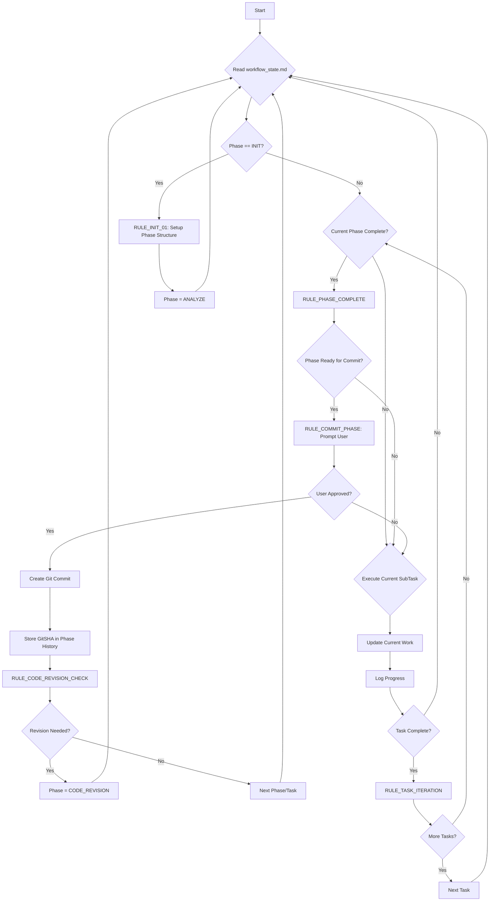
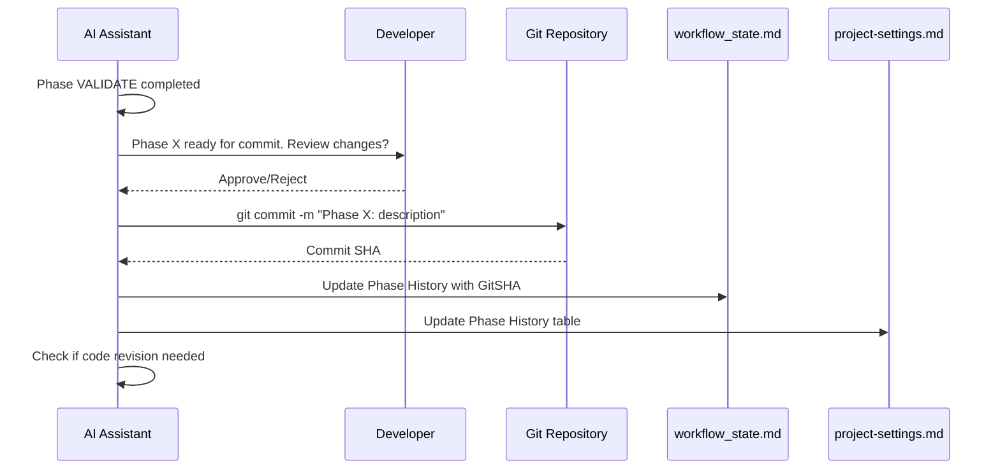

# Enhanced Autonomous AI Workflow for Cursor IDE

<div align="center">
  
  <p><em>A sophisticated, autonomous system for AI-assisted development with hierarchical workflow management and Git integration</em></p>
</div>

## What is this?

This project provides an advanced autonomous workflow system for AI assistants in Cursor IDE, featuring:

- **Hierarchical Work Structure**: Phases > Tasks > SubTasks organization
- **Git Integration**: Automatic phase commits with GitSHA tracking for semantic memory
- **Code Revision Cycles**: Automated refactoring and optimization every 3-5 phases
- **Enhanced Memory Management**: Long-term project context with point-in-time references
- **Production-Ready Output**: No TODOs, complete implementations, full testing

This system builds upon the original autonomous workflow concept but extends it to support complex, multi-phase projects with persistent memory and quality assurance.

## How it Works: Enhanced Three-File System

The system now uses three core files for comprehensive project management:

1.  **`.cursorrules` (Global AI Behavior):**
    *   **Purpose:** Defines AI assistant behavior and coding standards.
    *   **Content:** Code quality rules, Git workflow patterns, file standards, error handling.
    *   **Usage:** Ensures consistent AI behavior across all Cursor sessions.

2.  **`project-settings.md` (Long-Term Memory - LTM):**
    *   **Purpose:** Holds stable project information and historical context.
    *   **Content:** Project goals, tech stack, constraints, **Phase History table** with GitSHAs, changelog.
    *   **Usage:** Provides semantic memory through Git references and project evolution tracking.

3.  **`workflow_state.md` (Active Workflow State - AWS):**
    *   **Purpose:** Dynamic workflow management and execution tracking.
    *   **Content:**
        *   `## State`: Current phase/task/subtask, counters, revision tracking
        *   `## Current Work`: Active work context with clear hierarchy
        *   `## Plan`: Detailed implementation plans with phase/task breakdowns
        *   `## Rules`: Complete workflow logic including Git integration
        *   `## Phase Structure`, `## Tasks`, `## SubTasks`: Hierarchical work organization
        *   `## Log`: Detailed execution history with automatic rotation

## The Enhanced Autonomous Loop

The AI operates in a sophisticated multi-level cycle:



## Workflow Phases (Enhanced)

The system now supports five distinct phases with clear hierarchical structure:

### 1. **[PHASE: ANALYZE]**
- Break down work into logical **Phases** (major milestones)
- Identify **Tasks** within each phase (implementation units)  
- Define **SubTasks** for each task (atomic actions)
- No coding, pure requirements analysis

### 2. **[PHASE: BLUEPRINT]** 
- Create detailed phase/task/subtask hierarchy
- Write comprehensive implementation plans
- Estimate complexity and identify dependencies
- Require user approval before proceeding

### 3. **[PHASE: CONSTRUCT]**
- Execute SubTasks sequentially within each Task
- Run tests/linters after each SubTask completion
- Update progress tracking in real-time
- Trigger phase completion when all tasks done

### 4. **[PHASE: VALIDATE]**
- Full test suite execution for completed phase
- Review deliverables against requirements
- Prepare phase for Git commit
- Trigger commit workflow

### 5. **[PHASE: CODE_REVISION]** *(New)*
- Review last 3-5 phases for quality issues
- Identify refactoring and optimization opportunities
- Security vulnerability scanning
- Execute improvements following standard phases

## Git Integration & Semantic Memory

### Phase Commit Workflow


### Semantic Memory Benefits
- **Point-in-time References**: Each phase GitSHA provides exact code state
- **Historical Context**: Full evolution tracking in Phase History table
- **Cross-session Memory**: Persistent context across Cursor restarts
- **Regression Testing**: Easy rollback to any previous phase state

## Code Revision Cycles

The system automatically triggers code revision phases to maintain quality:

### Trigger Conditions
- Every 3-5 completed phases (configurable)
- Based on accumulated complexity
- Manual trigger available

### Revision Focus Areas
- **Decomposition**: Break down monolithic code growth
- **Reusability**: Extract shared functions and utilities  
- **Security**: Scan for potential vulnerabilities
- **Performance**: Identify optimization opportunities
- **Maintainability**: Improve code structure and documentation

## Getting Started

### 1. **Repository Setup**
```bash
# Clone the enhanced workflow template
git clone <your-forked-repo>
cd cursorkleosr

# Ensure you're on a feature branch, not main
git checkout -b feature/project-setup
```

### 2. **Configure Project Settings**
Edit `project-settings.md`:
- Set your project goals and tech stack
- Define coding patterns and constraints
- Configure Git workflow preferences
- Set tokenization limits

### 3. **Initialize Workflow**
Start Cursor and give the AI its first instruction:
```
Initialize enhanced workflow system. Read project-settings.md and workflow_state.md, then ask for the first high-level project phase.
```

### 4. **Work in Phases**
The AI will:
- Break your project into logical phases
- Create detailed task/subtask breakdowns
- Execute work systematically
- Commit each phase with your approval
- Track everything in Git history

## Advanced Features

### Hierarchical Work Organization
```
Project
├── Phase 1: Foundation Setup
│   ├── Task 1.1: Project Structure
│   │   ├── SubTask 1.1.1: Create directories
│   │   ├── SubTask 1.1.2: Setup package.json
│   │   └── SubTask 1.1.3: Configure build tools
│   └── Task 1.2: Core Dependencies
│       ├── SubTask 1.2.1: Install frameworks
│       └── SubTask 1.2.2: Setup testing
└── Phase 2: Core Implementation
    └── ...
```

### Memory Management
- **Short-term**: Current work context in `workflow_state.md`
- **Medium-term**: Phase execution logs with rotation
- **Long-term**: GitSHA references and project evolution in `project-settings.md`

### Error Recovery
- Automatic retry logic for common issues
- Context preservation during errors
- User escalation for critical blocks
- Historical error analysis for learning

## Best Practices Integration

### File Naming Standards
- Configuration files: `kebab-case.md`
- Source code: Follow tech stack conventions
- Documentation: Clear, semantic names

### Git Workflow
- Never commit directly to `main`
- Feature branches for all work: `feature/phase-description`
- Descriptive commit messages with phase references
- GitSHA tracking for semantic memory

### Code Quality
- Production-ready code only
- Complete implementations (no TODOs)
- Full test coverage
- Security-first approach

## Migration from Original System

If upgrading from the original workflow:

1. **Backup** existing `project_config.md` and `workflow_state.md`
2. **Rename** `project_config.md` → `project-settings.md`
3. **Update** workflow_state.md structure using provided template
4. **Create** `.cursorrules` file
5. **Initialize** Phase History table with existing work
6. **Commit** migration as "Phase 0: Workflow Migration"

## Thanks to

*   @atalas [Atalas Cursor IDE Profile](https://forum.cursor.com/u/atalas) 
*   @Guayusa [Guayusa Cursor IDE Profile](https://forum.cursor.com/u/Guayusa) 
*   @stevejb [Stevejb Cursor IDE Profile](https://forum.cursor.com/u/stevejb) 
*   Contributors to the original `kleosr/cursorkleosr` concepts.

## License

This project is licensed under the MIT License - see the LICENSE file for details.

## Contributing

We welcome contributions that enhance the workflow system:
- Phase management improvements
- Git integration enhancements  
- Code revision automation
- Memory management optimizations
- Documentation and examples
