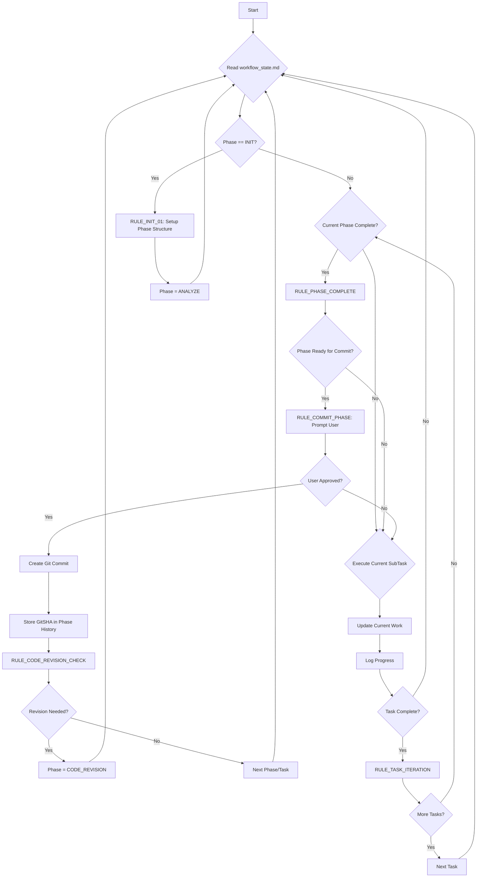
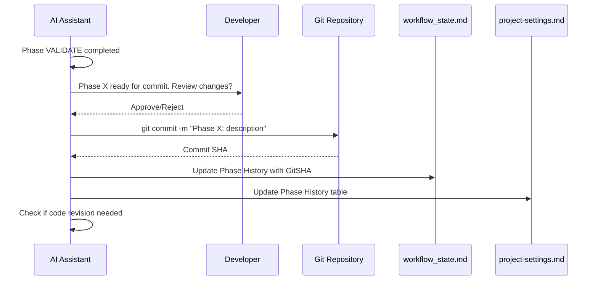

# Agility CMS Cursor Workflow Starter

<div align="center">
  
  <p><em>The ultimate Cursor AI starter for building high-performance websites with Agility CMS</em></p>
</div>

## Overview

This repository provides a specialized autonomous AI workflow system for building frontend websites with **Agility CMS**. It includes comprehensive SDK documentation, framework-specific tooling, and an enhanced Cursor workflow with hierarchical **Phases > Tasks > SubTasks** organization, **non-blocking user interaction system**, and **automatic archiving capabilities**.

**🚀 Agility CMS Ready**: Includes complete SDK documentation and best practices for all Agility CMS development scenarios - from simple websites to complex applications.

**🔧 Drop-In Ready**: Organized following Cursor IDE best practices with all configuration files properly placed in `.cursor/` directories for seamless integration.

## Key Features

### 🚀 **Agility CMS Specialized Tooling**
- Complete SDK documentation for all development scenarios
- Pre-configured best practices for content fetching and management
- TypeScript content model definitions and optimization patterns

### 🔄 **Non-Blocking User Interactions**
- AI continues working while waiting for user input
- Tool-call based interaction system
- Multiple concurrent interactions supported
- Configurable timeouts with reasonable defaults

### 📦 **Automatic Archiving System**
- Intelligent file size management
- Automatic archiving when files exceed thresholds
- Full context preservation with GitSHA references
- Easy recovery and restoration operations

### 🎯 **Hierarchical Work Management**
- **Phases**: Major project milestones
- **Tasks**: Implementation units within phases
- **SubTasks**: Atomic actions within tasks

### 🧠 **Semantic Memory**
- GitSHA references for point-in-time recovery
- Cross-session context preservation
- Historical tracking with archived context

### ⚡ **Automated Quality Assurance**
- Production-ready code standards with Agility CMS best practices
- Automated code revision cycles
- Continuous testing and validation

### 🔧 **Drop-In Architecture**
- Follows Cursor IDE best practices for `.cursor/rules/` organization
- Clean project root with only essential working files
- Configuration files properly scoped for team collaboration
- Examples organized in `.cursor/rules/examples/` directory
- **File Format**: Uses standard `.md` format for maximum compatibility with editors, tools, and LLMs

### 📊 **LLM Performance Optimization**
- **30 focused files** (150-400 lines each) for optimal context windows
- **Semantic headers** with descriptive titles for better search
- **Cross-references** linking related concepts across files
- **Metadata tags** for improved AI assistant navigation
- **File index** (`.cursor/libs/file-index.md`) for comprehensive file mapping
- **YAML frontmatter** on key files for enhanced LLM understanding and categorization
- **Frontmatter template** (`.cursor/libs/frontmatter-template.md`) for consistent metadata structure

### 🎨 **Figma MCP Integration**

The Figma MCP (Model Context Protocol) integration enables seamless design-to-code workflows for Agility CMS projects, bridging the gap between design and development.

## 🔧 **MCP Server Configuration**

### **Prerequisites**
- Cursor IDE (latest version with MCP support)
- Figma account with API access
- Playwright for testing (optional)

### **Environment Setup**

Create a `.env.local` file in your project root:

```env
# Figma Configuration
FIGMA_ACCESS_TOKEN=your-figma-personal-access-token
FIGMA_FILE_ID=your-figma-file-id
FIGMA_TEAM_ID=your-figma-team-id

# Agility CMS Configuration  
AGILITY_GUID=your-agility-instance-guid
AGILITY_API_KEY=your-agility-fetch-api-key
AGILITY_SECURITY_KEY=your-agility-security-key
AGILITY_LOCALE=en-us

# Build Configuration
NEXT_PUBLIC_SITE_URL=http://localhost:3000
AGILITY_PREVIEW_URL=http://localhost:3000
AGILITY_PRODUCTION_URL=https://your-production-site.com
NODE_ENV=development

# Optional: Playwright Configuration
PLAYWRIGHT_BASE_URL=http://localhost:3000
```

### **Cursor MCP Configuration**

Add MCP servers to your Cursor settings. Access **Cursor Settings > Features > Model Context Protocol**:

#### **Figma MCP Server**
```json
{
  "name": "figma",
  "command": "npx",
  "args": ["@figma-tools/mcp-server"],
  "env": {
    "FIGMA_ACCESS_TOKEN": "${FIGMA_ACCESS_TOKEN}"
  }
}
```

#### **Playwright MCP Server** 
```json
{
  "name": "playwright",
  "command": "npx", 
  "args": ["@playwright/mcp-server"],
  "env": {
    "PLAYWRIGHT_BASE_URL": "${NEXT_PUBLIC_SITE_URL}"
  }
}
```

### **Alternative Configuration File**

Create `.cursor/mcp-servers.json` in your project:

```json
{
  "mcpServers": {
    "figma": {
      "command": "npx",
      "args": ["@figma-tools/mcp-server"],
      "env": {
        "FIGMA_ACCESS_TOKEN": "${FIGMA_ACCESS_TOKEN}",
        "FIGMA_FILE_ID": "${FIGMA_FILE_ID}",
        "FIGMA_TEAM_ID": "${FIGMA_TEAM_ID}"
      }
    },
    "playwright": {
      "command": "npx",
      "args": ["@playwright/mcp-server"],
      "env": {
        "PLAYWRIGHT_BASE_URL": "${NEXT_PUBLIC_SITE_URL}",
        "AGILITY_PREVIEW_URL": "${NEXT_PUBLIC_SITE_URL}",
        "AGILITY_PRODUCTION_URL": "${AGILITY_PRODUCTION_URL}"
      }
    }
  }
}
```

---

## 🎨 **Figma Design Integration**

### **Getting Figma Access Token**

1. **Visit Figma Settings**: Go to [figma.com/settings](https://figma.com/settings)
2. **Generate Token**: Scroll to "Personal Access Tokens" and create a new token
3. **Set Permissions**: Ensure "File content" read access
4. **Copy Token**: Add to your `.env.local` file

### **Finding Your Figma File ID**

Extract from Figma URL:
```
https://www.figma.com/file/FILE_ID/Your-Design-Name
                            ^^^^^^^^
```

### **Design Token Extraction**

Once MCP is configured, you can use natural language with Cursor:

```
"Extract design tokens from the Figma file and generate a Tailwind config"

"Generate React components from the hero section in Figma"

"Create AgilityPic-optimized components from the gallery design"
```

### **Component Generation Workflow**

The AI will automatically:
- Extract design tokens (colors, typography, spacing)
- Generate React components with proper TypeScript
- Integrate with Agility CMS data fetching patterns
- Optimize images for AgilityPic component
- Create responsive designs with Tailwind CSS

---

## 🧪 **Playwright Testing Integration**

### **Test Environment Setup**

Create `playwright.config.ts`:

```typescript
import { defineConfig } from '@playwright/test';

export default defineConfig({
  testDir: './tests',
  fullyParallel: true,
  forbidOnly: !!process.env.CI,
  retries: process.env.CI ? 2 : 0,
  workers: process.env.CI ? 1 : undefined,
  reporter: 'html',
  
  use: {
    baseURL: process.env.PLAYWRIGHT_BASE_URL || 'http://localhost:3000',
    trace: 'on-first-retry',
  },

  projects: [
    {
      name: 'agility-content-tests',
      testMatch: '**/content/*.spec.ts',
      use: {
        baseURL: process.env.AGILITY_PREVIEW_URL || 'http://localhost:3000',
      }
    },
    {
      name: 'agility-performance-tests', 
      testMatch: '**/performance/*.spec.ts',
      use: {
        baseURL: process.env.AGILITY_PRODUCTION_URL || 'http://localhost:3000',
      }
    },
    {
      name: 'agility-visual-tests',
      testMatch: '**/visual/*.spec.ts',
    }
  ],

  webServer: {
    command: 'npm run dev',
    url: 'http://localhost:3000',
    reuseExistingServer: !process.env.CI,
  },
});
```

### **Automated Testing with MCP**

With Playwright MCP configured, use natural language:

```
"Create tests for the blog listing page with Agility CMS content"

"Generate performance tests for Core Web Vitals compliance"

"Create visual regression tests for the hero component"
```

### **Test Categories**

#### **Content Validation Tests**
```typescript
// Example generated by MCP
test('should render blog posts from Agility CMS', async ({ page }) => {
  await page.goto('/blog');
  
  const blogPosts = await page.locator('[data-agility-content="posts"]');
  await expect(blogPosts).toBeVisible();
  
  const firstPost = blogPosts.first();
  await expect(firstPost.locator('h2')).toBeVisible();
});
```

#### **Performance Tests**
```typescript
// Example generated by MCP
test('should meet Core Web Vitals', async ({ page }) => {
  await page.goto('/');
  
  const vitals = await page.evaluate(() => {
    return new Promise((resolve) => {
      import('web-vitals').then(({ getLCP, getFID, getCLS }) => {
        const metrics = {};
        getLCP(metric => metrics.lcp = metric.value);
        getFID(metric => metrics.fid = metric.value);
        getCLS(metric => {
          metrics.cls = metric.value;
          resolve(metrics);
        });
      });
    });
  });
  
  expect(vitals.lcp).toBeLessThan(2500);
  expect(vitals.fid).toBeLessThan(100);
  expect(vitals.cls).toBeLessThan(0.1);
});
```

---

## 🔄 **Enhanced Workflow Integration**

### **MCP-Enhanced Development Phases**

With MCP servers configured, your workflow becomes:

```yaml
Phase 1: Design Analysis & Setup
  Tasks:
    - "Extract design tokens from Figma file [FILE_ID]"
    - "Analyze component structure and create implementation plan"
    - "Set up test scenarios for key user flows"
    
Phase 2: Component Development
  Tasks:
    - "Generate React components from Figma designs"
    - "Integrate components with Agility CMS data fetching"
    - "Create responsive layouts with extracted design tokens"
    
Phase 3: Content Integration  
  Tasks:
    - "Map Figma components to Agility module definitions"
    - "Implement dynamic content areas with proper TypeScript"
    - "Set up preview mode and SEO optimization"
    
Phase 4: Testing & Validation
  Tasks:
    - "Generate comprehensive test suite for content validation"
    - "Create performance tests for Core Web Vitals compliance"
    - "Set up visual regression tests for design consistency"
    
Phase 5: Deployment & Monitoring
  Tasks:
    - "Configure production deployment pipeline"
    - "Set up continuous testing with Playwright"
    - "Implement performance monitoring and alerts"
```

### **Natural Language Commands**

With both MCPs active, you can use commands like:

- `"Extract the color palette from Figma and update our Tailwind config"`
- `"Generate a React component for the hero section with Agility CMS integration"`
- `"Create tests to validate the blog listing renders correctly"`
- `"Generate performance tests for the entire site"`
- `"Take screenshots of all components for visual regression testing"`

---

## 🚀 **Getting Started with MCP**

### **1. Install Dependencies**
```bash
npm install @playwright/test
npm install -D @figma-tools/mcp-server @playwright/mcp-server
```

### **2. Configure Environment Variables**
Copy `.env.example` to `.env.local` and fill in your credentials.

### **3. Set Up MCP Servers**
Configure the MCP servers in Cursor settings or create `.cursor/mcp-servers.json`.

### **4. Verify Setup**
Ask Cursor: `"List available Figma files"` or `"Run a simple test to verify Playwright setup"`

### **5. Start Development**
Begin with: `"Extract design tokens from Figma and create the initial component structure"`

---

## 🎯 **Best Practices**

### **Environment Security**
- Never commit `.env.local` files
- Use environment variables for all sensitive data
- Rotate Figma tokens regularly
- Use different tokens for development/production

### **Design Workflow**
- Keep Figma files organized with clear component naming
- Use Figma's component variants for responsive designs  
- Document design tokens in Figma for consistency
- Create component libraries for reusable elements

### **Testing Strategy**
- Start with content validation tests
- Add performance tests for critical pages
- Use visual regression tests for design consistency
- Set up CI/CD integration with test automation

This approach provides a proper foundation for MCP integration with actual configuration steps and realistic usage patterns.

## Quick Start

### 1. System Requirements
- Cursor IDE with AI assistant
- Git repository
- Bash shell (for recovery scripts)

### 2. Setup
```bash
# Clone or download this repository
git clone [repository-url]
cd enhanced-cursor-workflow

# Initialize the system
git checkout -b feature/your-project-name
```

### 3. Configuration
Edit `.cursor/rules/project-settings.md` with your project details:
- Project goals and tech stack
- Archiving thresholds and preferences
- User interaction timeout settings
- Git workflow configuration

### 4. Start Development
Use this system prompt in Cursor:

```
You are an autonomous AI developer using the Enhanced Cursor Workflow System with non-blocking user interactions and automatic archiving.

**Configuration Files**:
- .cursor/rules/project-settings.md: Long-term project context, tech stack, Phase History with GitSHAs, archiving configuration
- .cursor/workflow_state.md: Current phase/task/subtask state, work structure, execution rules, user interactions
- .cursor/tools/user-interaction-system.md: Non-blocking interaction patterns and response processing
- .cursor/tools/archiving-system.md: Automatic file management and recovery operations
- .cursorrules: Global behavior standards (automatically loaded)

**Enhanced Operating Loop**:
1. Read .cursor/workflow_state.md → identify current phase/task/subtask and check for pending interactions
2. Check archive sizes via RULE_ARCHIVE_SIZE_CHECK → archive if needed
3. Process pending user interactions via RULE_CHECK_INTERACTIONS
4. Read project-settings.md → understand project context and constraints
5. Execute current phase following defined rules
6. Update workflow_state.md with progress and logs
7. Apply automatic rules (log rotation, phase completion, archiving, Git integration)
8. Continue with available work while waiting for user responses

Start by reading all configuration files, checking for pending interactions, verifying archive status, then ask for the first high-level project phase if in INIT state.
```

## What's New: Drop-In Organization

This system has been reorganized to follow Cursor IDE best practices:

### Before (Legacy)
```
project/
├── project-settings.md
├── user-interaction-system.md
├── archiving-system.md
├── tool-chain-example.md
├── workflow_state.md
├── .cursorrules
└── .cursor/
    ├── archive/
    └── recovery-scripts/
```

### After (Drop-In Ready)
```
project/
├── .cursorrules              # Auto-loaded by Cursor
└── .cursor/
    ├── workflow_state.md     # Active working file
    ├── rules/                # Configuration files
    │   ├── project-settings.md
    │   └── examples/
    │       └── tool-chain-example.md
    ├── tools/                # Tools and utilities
    │   ├── user-interaction-system.md
    │   ├── archiving-system.md
    │   ├── archive-index.md
    │   └── recovery-scripts/
    │       └── restore-from-archive.sh
    └── archive/              # Automatic archiving
```

### Benefits
- **Cleaner project root**: Only essential working files visible
- **Cursor best practices**: Follows official `.cursor/rules/` organization
- **Team collaboration**: Configuration files properly scoped
- **Easy integration**: Drop into any existing project
- **Organized examples**: Tool chain examples in dedicated `examples/` directory

## System Architecture

### Core Files

| File | Purpose | Update Frequency |
|------|---------|------------------|
| `.cursor/rules/project-settings.md` | Long-term project context, GitSHA history | Rarely |
| `.cursor/workflow_state.md` | Active workflow state, user interactions | Constantly |
| `.cursor/tools/user-interaction-system.md` | Interaction patterns and processing rules | Occasionally |
| `.cursor/tools/archiving-system.md` | Archive configuration and recovery procedures | Rarely |
| `.cursorrules` | Global AI behavior standards | Rarely |

### Directory Structure
```
project/
├── Instructions.md
├── README.md
├── .cursorrules
└── .cursor/
    ├── workflow_state.md
    ├── rules/
    │   ├── project-settings.md
    │   └── examples/
    │       └── tool-chain-example.md
    ├── libs/                 # Agility CMS SDK Documentation (30 optimized files)
    │   ├── README.md         # Master index with navigation
    │   ├── fetch-sdk/        # 6 files: core-apis, content-operations, etc.
    │   ├── next-sdk/         # 10 files: app-router-setup, data-fetching, etc.
    │   ├── management-sdk/   # 5 files: api-client-setup, content-operations, etc.
    │   ├── sync-sdk/         # 5 files: sync-client-setup, build-integration, etc.
    │   └── apps-sdk/         # 4 files + examples: custom-fields, authentication, etc.
    ├── tools/
    │   ├── user-interaction-system.md
    │   ├── archiving-system.md
    │   ├── archive-index.md
    │   └── recovery-scripts/
    │       └── restore-from-archive.sh
    └── archive/
        ├── workflow_state/
        ├── project_settings/
        ├── logs/
        └── interactions/
```

## Agility CMS Development

### SDK Documentation
This starter includes **LLM-optimized** documentation for all Agility CMS SDKs - **30 focused files** (150-400 lines each) organized for maximum retrieval efficiency:

| SDK | Files | Purpose | Best For |
|-----|-------|---------|----------|
| **Fetch SDK** | 6 files | Content retrieval from CDN | Data fetching, content queries |
| **Next.js SDK** | 10 files | Next.js integration | Page generation, SSG/SSR |
| **Management SDK** | 5 files | Content management operations | CRUD operations, workflows |
| **Sync SDK** | 5 files | Build-time synchronization | Static site generation |
| **Apps SDK** | 4 files + examples | Custom field/app development | Extending CMS functionality |

**Optimization Benefits:**
- 🎯 **Better LLM Retrieval**: Semantic search finds exact content faster
- 📝 **Focused Context**: Each file covers one specific topic deeply
- ⚡ **Parallel Learning**: Process multiple related files simultaneously
- 🔧 **Easy Maintenance**: Update specific functionality without affecting others
- 🧭 **Developer Navigation**: Find what you need quickly with clear organization

### Quick Reference Examples
- **Content fetching**: `.cursor/libs/fetch-sdk/content-operations.md`
- **Next.js pages**: `.cursor/libs/next-sdk/data-fetching.md`
- **Custom fields**: `.cursor/libs/apps-sdk/custom-fields.md`
- **Content management**: `.cursor/libs/management-sdk/content-operations.md`
- **Build integration**: `.cursor/libs/sync-sdk/build-integration.md`

### Development Patterns
The AI will automatically:
- Use appropriate SDK based on your use case
- Implement TypeScript interfaces for content models
- Follow Agility CMS best practices for performance
- Use AgilityPic component for image optimization
- Set up proper preview mode and SEO patterns

### Getting Started with Agility CMS
1. **Configure your instance**: Update `.cursor/rules/project-settings.md` with your Agility details
2. **Start development**: The AI will guide you through proper Agility CMS implementation patterns

## User Interaction System

### Two Modes Available

#### 1. Always-Ask Mode (Default)
- AI asks for approval before commits
- Uses non-breaking terminal input capture
- Configurable timeouts with semantic responses

#### 2. Insanity Mode 🚀
- AI auto-commits everything without asking
- Maximum speed and efficiency
- Use with caution!

### Mode Configuration
Simply edit the **Default Mode** in `.cursorrules`:

```yaml
### Commit Behavior
- **Mode Options**: insanity, always-ask
- **Default Mode**: always-ask    # Change to "insanity" for auto-commit
```

### How It Works
1. **AI checks mode**: Reads Default Mode from .cursorrules
2. **Always-ask mode**: Creates non-breaking terminal input for approval
3. **Insanity mode**: Auto-commits immediately without asking
4. **Workflow continues**: Uses all 25 tool calls efficiently regardless of mode

### Interaction Types
- **COMMIT_APPROVAL**: Phase commit confirmation
- **PLAN_APPROVAL**: Blueprint plan approval
- **MANUAL_INPUT**: Custom user input requests
- **CONFIRMATION**: Yes/No confirmations
- **CHOICE_SELECTION**: Multiple choice options
- **TEXT_INPUT**: Free-form text responses

### Response Methods

**Method 1: Terminal Input (Non-Breaking)**
Respond directly in terminal when prompted:
```bash
============================================
         USER INPUT REQUIRED
============================================

Prompt: Phase 3 completed. Ready to commit?
Default response (timeout 300s): approve
Timeout action: Continue

Please provide your response:
approve  # Type your response here
```

**Method 2: Direct Table Edit**
Edit the Response column in .cursor/workflow_state.md:
```markdown
| INT001 | COMMIT_APPROVAL | "Phase 3 completed. Ready to commit?" | PENDING | 2025-01-16T10:30:00Z | approve |
```

**Method 3: Natural Language**
Respond in conversation:
"For INT001: approve the commit"

### Semantic Timeout Handling
- **Continue**: Apply default action and continue workflow automatically
- **Wait**: Pause workflow until you provide explicit response
- Configured per interaction type in `.cursorrules`

## Archiving System

### Automatic Archiving
Files are automatically archived when they exceed size thresholds:
- `.cursor/workflow_state.md`: 15,000 characters
- `.cursor/rules/project-settings.md`: 12,000 characters
- `.cursor/tools/user-interaction-system.md`: 10,000 characters
- Log sections: 5,000 characters

### Archive Structure
```
.cursor/archive/workflow_state/workflow_state-2025-01-16T10-30-00Z.md
```

Each archive includes:
- Complete original content
- Comprehensive metadata
- GitSHA references
- Phase context
- Recovery instructions

### Recovery Operations

**List Available Archives**
```bash
.cursor/tools/recovery-scripts/restore-from-archive.sh -l
```

**Extract Context Only**
```bash
.cursor/tools/recovery-scripts/restore-from-archive.sh ARC-WF-20250116-001
```

**Full Restoration**
```bash
.cursor/tools/recovery-scripts/restore-from-archive.sh ARC-WF-20250116-001 -f -b
```

**Merge with Current**
```bash
.cursor/tools/recovery-scripts/restore-from-archive.sh ARC-WF-20250116-001 -m
```

## Workflow Phases

### Phase Types
1. **ANALYZE**: Break down requirements into hierarchical structure
2. **BLUEPRINT**: Create detailed implementation plans (non-blocking approval)
3. **CONSTRUCT**: Execute planned work systematically
4. **VALIDATE**: Test and verify completion (non-blocking commit approval)
5. **CODE_REVISION**: Systematic quality review and refactoring

### Phase Flow
- Each phase contains multiple **Tasks**
- Each task contains multiple **SubTasks**
- Progress tracked at all levels
- Automatic advancement with user interaction checkpoints

## Git Integration

### Semantic Memory
- Every phase completion creates a Git commit
- GitSHA stored in Phase History table
- Point-in-time recovery capabilities
- Cross-session context preservation

### Commit Workflow
1. AI completes VALIDATE phase
2. Creates non-blocking commit approval interaction
3. Continues other work while waiting for approval
4. Processes approval and creates commit when ready
5. Updates GitSHA references in multiple locations

## Best Practices

### For Users
- **Respond promptly** to interactions for optimal flow
- **Use clear responses**: "approve", "reject", "modify"
- **Add context** in responses when needed
- **Monitor archive health** via archive index
- **Trust automatic systems** - they preserve all context

### For AI Sessions
- **Check interactions** at start of every major operation
- **Monitor file sizes** and trigger archiving proactively
- **Preserve context** in all archive operations
- **Continue available work** while waiting for user input
- **Process multiple interactions** efficiently

## Troubleshooting

### Common Issues

**Interactions Not Processing**
- Verify `RULE_CHECK_INTERACTIONS` is running
- Check interaction table format
- Ensure responses use clear keywords

**Archive Issues**
- Check `.cursor/archive` directory permissions
- Verify archive index integrity
- Use recovery scripts for restoration

**Performance Problems**
- Monitor file sizes approaching thresholds
- Use archive system proactively
- Check for log rotation effectiveness

### Recovery Options
- **Git history**: Use GitSHA references for rollback
- **Archive system**: Restore from archived states
- **Recovery scripts**: Automated restoration tools
- **Manual recovery**: Context extraction and merging

## Migration Guide

### From Basic Workflow
1. Backup existing files
2. Update file structure to enhanced system
3. Add interaction and archiving configurations
4. Initialize with enhanced system prompt

### From Manifest.md Systems
1. Export existing task breakdown
2. Convert to Phase > Task > SubTask hierarchy
3. Preserve critical decision history
4. Initialize enhanced workflow

## Advanced Configuration

### Customization Options
- **Archive thresholds**: Adjust per file type in project-settings.md
- **Interaction timeouts**: Configure per interaction type
- **Code revision frequency**: Set phase intervals
- **Git workflow**: Customize branch and commit patterns

### Performance Tuning
- **Log rotation**: Optimize frequency and size limits
- **Archive compression**: Enable for large archives
- **Recovery caching**: Cache frequently accessed archives
- **Interaction batching**: Group similar interactions

## Support

### Resources
- **Instructions.md**: Complete system documentation
- **user-interaction-system.md**: Detailed interaction patterns
- **archiving-system.md**: Archive management procedures
- **Recovery scripts**: Automated restoration tools

### Getting Help
1. Check archive index for historical context
2. Use recovery scripts for context restoration
3. Review interaction history for decision audit
4. Examine GitSHA references for point-in-time states

This enhanced system provides robust, scalable AI-assisted development with persistent memory, non-blocking user interactions, automatic file management, and systematic progression through complex projects of any size.

## How it Works: Enhanced Three-File System

The system now uses three core files for comprehensive project management:

1.  **`.cursorrules` (Global AI Behavior):**
    *   **Purpose:** Defines AI assistant behavior and coding standards.
    *   **Content:** Code quality rules, Git workflow patterns, file standards, error handling.
    *   **Usage:** Ensures consistent AI behavior across all Cursor sessions.

2.  **`project-settings.md` (Long-Term Memory - LTM):**
    *   **Purpose:** Holds stable project information and historical context.
    *   **Content:** Project goals, tech stack, constraints, **Phase History table** with GitSHAs, changelog.
    *   **Usage:** Provides semantic memory through Git references and project evolution tracking.

3.  **`workflow_state.md` (Active Workflow State - AWS):**
    *   **Purpose:** Dynamic workflow management and execution tracking.
    *   **Content:**
        *   `## State`: Current phase/task/subtask, counters, revision tracking
        *   `## Current Work`: Active work context with clear hierarchy
        *   `## Plan`: Detailed implementation plans with phase/task breakdowns
        *   `## Rules`: Complete workflow logic including Git integration
        *   `## Phase Structure`, `## Tasks`, `## SubTasks`: Hierarchical work organization
        *   `## Log`: Detailed execution history with automatic rotation

## The Enhanced Autonomous Loop

The AI operates in a sophisticated multi-level cycle:



## Workflow Phases (Enhanced)

The system now supports five distinct phases with clear hierarchical structure:

### 1. **[PHASE: ANALYZE]**
- Break down work into logical **Phases** (major milestones)
- Identify **Tasks** within each phase (implementation units)  
- Define **SubTasks** for each task (atomic actions)
- No coding, pure requirements analysis

### 2. **[PHASE: BLUEPRINT]** 
- Create detailed phase/task/subtask hierarchy
- Write comprehensive implementation plans
- Estimate complexity and identify dependencies
- Require user approval before proceeding

### 3. **[PHASE: CONSTRUCT]**
- Execute SubTasks sequentially within each Task
- Run tests/linters after each SubTask completion
- Update progress tracking in real-time
- Trigger phase completion when all tasks done

### 4. **[PHASE: VALIDATE]**
- Full test suite execution for completed phase
- Review deliverables against requirements
- Prepare phase for Git commit
- Trigger commit workflow

### 5. **[PHASE: CODE_REVISION]** *(New)*
- Review last 3-5 phases for quality issues
- Identify refactoring and optimization opportunities
- Security vulnerability scanning
- Execute improvements following standard phases

## Git Integration & Semantic Memory

### Phase Commit Workflow


### Semantic Memory Benefits
- **Point-in-time References**: Each phase GitSHA provides exact code state
- **Historical Context**: Full evolution tracking in Phase History table
- **Cross-session Memory**: Persistent context across Cursor restarts
- **Regression Testing**: Easy rollback to any previous phase state

## Code Revision Cycles

The system automatically triggers code revision phases to maintain quality:

### Trigger Conditions
- Every 3-5 completed phases (configurable)
- Based on accumulated complexity
- Manual trigger available

### Revision Focus Areas
- **Decomposition**: Break down monolithic code growth
- **Reusability**: Extract shared functions and utilities  
- **Security**: Scan for potential vulnerabilities
- **Performance**: Identify optimization opportunities
- **Maintainability**: Improve code structure and documentation

## Getting Started

### 1. **Repository Setup**
```bash
# Clone the enhanced workflow template
git clone <your-forked-repo>
cd cursorkleosr

# Ensure you're on a feature branch, not main
git checkout -b feature/project-setup
```

### 2. **Configure Project Settings**
Edit `project-settings.md`:
- Set your project goals and tech stack
- Define coding patterns and constraints
- Configure Git workflow preferences
- Set tokenization limits

### 3. **Initialize Workflow**
Start Cursor and give the AI its first instruction:
```