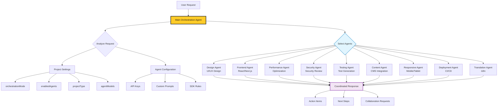

# 🚀 Kairo Multi-Agent Development Platform


AI-powered development platform with 9 specialized agents and a snazzy electron env.

## ⚡ **Quick Start from Repository Root**

```bash
# One-command setup
npm run setup

# Start development (default web mode)
npm run dev

# Or try enhanced Proton mode
npm run proton:dev
```

## 🎯 **All Available Commands**

### **🚀 Development**
```bash
npm run dev           # Start web development (default)
npm run web:dev       # Start web development explicitly
npm run proton:dev    # Start enhanced Proton development
```

### **📦 Building & Production**
```bash
npm run build         # Build for web production
npm run web:build     # Build for web production
npm run web:start     # Start web production server
npm run proton:build  # Build with Proton optimizations
npm run proton:start  # Start Proton production server
```

### **📊 Environment & Status**
```bash
npm run check         # Check dual-mode compatibility
npm run proton:status # Check Proton CLI status
npm run proton:info   # Show detailed environment info
```

### **🛠 Setup & Maintenance**
```bash
npm run setup         # Full setup (install + check)
npm run install:all   # Install all dependencies
npm run lint          # Run linting across platform
```

## 🌟 **What Kairo Provides**

- **🤖 9 Specialized AI Agents**: Design, Frontend, Content, Testing, Performance, Security, Responsive, Deployment, Translation
- **🔄 Live Preview**: Real-time code execution and preview in browser
- **⚡ Enhanced Development**: Hot reload, advanced bundling, edge simulation
- **🎯 Type-Safe**: Full TypeScript integration throughout
- **📦 TurboRepo**: Optimized monorepo with workspace management
- **🚀 Dual-Mode**: Choose traditional web or enhanced Proton experience
- **🌐 Universal Deploy**: Web, Proton cloud, or container deployment

## 🏗 **Platform Architecture**

```
kairo/                    # Repository root
├── README.md                    # This file
├── QUICK-START.md              # Quick start guide
├── package.json                # Root commands
└── kairo-platform/             # Main platform
    ├── apps/
    │   ├── web/                # Main UI application
    │   ├── agents/             # AI agent system  
    │   └── docs/               # Documentation
    ├── tools/proton-dev/       # Local Proton CLI
    ├── lib/runtime-config.ts   # Dual-mode detection
    ├── proton.config.js        # Proton configuration
    └── DUAL-MODE-SETUP.md      # Detailed setup guide
```

## 🤖 **Agent Architecture**

Kairo uses a sophisticated multi-agent orchestration system where a Main Orchestration Agent coordinates with 9 specialized agents based on project configuration and user requests.

### **Orchestration Flow**



### **Configuration-Driven Orchestration**

The orchestration system reads configuration from the project settings to determine:

- **🎯 Agent Selection**: Which agents to activate based on `enabledAgents` array
- **🧠 Model Assignment**: Which AI model each agent uses via `agentModels` mapping  
- **⚙️ Orchestration Mode**: How agents collaborate (`intelligent`, `manual`, `sequential`)
- **🔑 API Integration**: Provider credentials and SDK-specific rules
- **📝 Custom Behavior**: Agent-specific prompts and instructions

### **Agent Specializations**

| Agent | Purpose | Key Capabilities |
|-------|---------|------------------|
| **Design** | UI/UX Design | Layout, styling, user experience optimization |
| **Frontend** | React/Next.js Development | Component architecture, state management |
| **Performance** | Speed & Optimization | Bundle analysis, performance monitoring |
| **Security** | Security Review | Vulnerability scanning, secure coding practices |
| **Testing** | Test Generation | Unit tests, integration tests, E2E scenarios |
| **Content** | CMS Integration | Agility CMS setup, content modeling |
| **Responsive** | Multi-device Support | Mobile-first design, responsive layouts |
| **Deployment** | CI/CD Pipeline | Build optimization, deployment strategies |
| **Translation** | Internationalization | Multi-language support, locale management |

### **How It Works**

1. **User Input**: You send a request through the Kairo UI
2. **Orchestration**: The Main Agent analyzes your request and project configuration
3. **Agent Selection**: Based on your `enabledAgents` and request type, relevant specialists are activated
4. **Coordination**: Each agent contributes their expertise using their configured AI model
5. **Response**: A unified response with action items, next steps, and collaboration requests

The system is fully configurable through the Project Settings modal, allowing you to:
- Enable/disable specific agents
- Assign different AI models to different agents
- Set custom prompts for specialized behavior
- Configure API keys for different providers
- Define SDK-specific rules and guidelines

## 🚀 **Getting Started**

1. **Clone** the repository
2. **Run** `npm run setup` from the root
3. **Start** development with `npm run dev`
4. **Open** your browser to see the platform
5. **Try** `npm run proton:dev` for enhanced features

## 🔗 **Test Project Setup (Optional)**

For enhanced development and testing, Kairo can automatically detect and run test projects:

### **Option 1: Official Test Project**
```bash
# Clone the official test project (recommended)
cd ..  # Go to parent directory of kairo
git clone https://github.com/agility/kairo-test-project
cd kairo
npm run app:dev  # Start desktop app with test project
```

### **Option 2: Custom Project**
Place any project with a `turbo dev --filter=web` command in the parent directory:
```bash
# Your directory structure should look like:
parent-directory/
├── kairo/                     # This repository
├── kairo-test-project/        # Official test project
└── your-custom-project/       # Any other project with turbo dev support
```

### **Preview Behavior**
- **With test project**: The preview panel loads your project on `localhost:3000`
- **Without test project**: The preview panel shows whatever is running on `localhost:3000`
- **Priority order**: kairo-test-project → any localhost:3000 content

### **Desktop App Commands**
```bash
npm run app:dev       # Start desktop app with project detection
npm run app:build     # Build desktop app for distribution
npm run app:pack      # Package desktop app
```

## 📚 **Documentation**

- [Quick Start Guide](./QUICK-START.md) - Get running in 2 minutes
- [Dual-Mode Setup](./kairo-platform/DUAL-MODE-SETUP.md) - Detailed configuration
- [Agent Documentation](./kairo-platform/apps/agents/README.md) - AI agent system
- [Platform README](./kairo-platform/README.md) - Complete platform docs

## 🎯 **Use Cases**

- **Rapid Prototyping**: Get AI agents to build your ideas
- **Code Review**: Security, performance, and best practice analysis  
- **Multi-Modal Development**: Web apps, mobile experiences, content management
- **Team Collaboration**: Specialized agents for different team roles
- **Learning**: See how AI approaches different development challenges

## 🤝 **Contributing**

1. Fork the repository
2. Create your feature branch (`git checkout -b feature/amazing-feature`)
3. Test with both `npm run dev` and `npm run proton:dev`
4. Commit your changes (`git commit -m 'Add amazing feature'`)
5. Push to the branch (`git push origin feature/amazing-feature`)
6. Open a Pull Request

---

**Built with ❤️ for the future of AI-powered development** 🤖✨

Ready to experience multi-agent development? Run `npm run setup` and get started!
